# Cultist - 3인 멀티플레이 카드 게임


## 목차

- [Ⅰ. 프로젝트 개요 (Overview)](#ⅰ-프로젝트-개요-overview)
- [Ⅱ. 시스템 아키텍처 (Architecture)](#ⅱ-시스템-아키텍처-architecture)
- [Ⅲ. 핵심 기능 및 구현 로직 (Core Features)](#ⅲ-핵심-기능-및-구현-로직-core-features)
   - [Chapter 1. 게임 상태 모델](#chapter-1-게임-상태-모델)
   - [Chapter 2. 시스템](#chapter-2-시스템)
   - [Chapter 3. 턴·페이즈 상태 머신](#chapter-3-턴페이즈-상태-머신)
   - [Chapter 4. 카드 효과 시스템](#chapter-4-카드-효과-시스템)

## Ⅰ. 프로젝트 개요 (Overview)

### 게임 소개 및 장르

게임 **Cultist**는 고대 지중해와 중동의 종교적, 인류학적 역사를 배경으로 하는 3인 멀티플레이 전략 카드 게임입니다. 플레이어는 정형화된 덱 기반 전투를 넘어, 카드들이 마치 뿌리처럼 뻗어나가며 자유롭게 분기하는 트리 구조(Tree Structure) 형태의 유기적인 필드 시스템을 통해 자신만의 교리와 세력을 확장해 나갑니다. 이 치열한 수싸움 속에서 시간의 시련을 견디는 거대한 종교로 거듭날 수도, 역사의 뒤안길로 사라진 유물 속 흔적으로 남을 수도 있습니다.

[](https://store.steampowered.com/app/4696600)
[](https://www.youtube.com/watch?v=ZR8SCa53bXo)

### 개발 환경 및 기술 스택 그리고 개발 관점

**Client (Game Engine)**

* **Engine:** Unity 6000.3.8f1 (URP 17.3.0 / Universal Render Pipeline)
* **Language:** C# (.NET / Unity Scripting Runtime)
* **Architecture/Pattern:**
  * 레이어드 아키텍처 (Domain → Data → Systems → Effects → Network → Scene/UI, 단방향 의존)
  * Component-Based (Unity MonoBehaviour 기반)
  * Host-Authoritative 네트워킹 (서버 권위 모델)
  * Command + Interpreter 패턴 (JSON DSL 카드 효과 시스템)
  * 보조: Registry, State Machine, Event Bus(Observer), Repository
* Key Libraries:
  * Mirror: 고수준 네트워킹 (NetworkManager / SyncVar / Command·Rpc)
  * FizzyFacepunch + Facepunch.Steamworks: Steam P2P 트랜스포트 & 로비/인증
  * kcp2k: 로컬 IP 트랜스포트 (로컬 멀티플레이 제공)
  * DOTween / DOTween Pro (Demigiant): UI·카메라 애니메이션 (Components/Effects)
  * Newtonsoft.Json: cardDB.json / cardsEffects.json DSL 파싱
  * Unity Input System 1.18.0 / TextMesh Pro / Unity UI (uGUI)

**Tools & Collaboration**
* **Version Control:** Git, GitHub
* **IDE:** Rider

<br>

> 이 프로젝트에서 프로그래머인 저의 역할은, 기획자가 머릿속에 그린 게임을 한 픽셀도 타협 없이 코드로 옮기는 것에 있습니다.
> 
> 따라서, **모든 구현의 완료 기준은 '동작한다'가 아닌, '기획 의도와 일치한다'에 두었습니다.**

## Ⅱ. 시스템 아키텍처 (Architecture)

멀티 플레이 카드 게임에서의 핵심은, 동기화입니다. 내가 카드를 냈다면, 상대도 그것을 인지할 수 있어야합니다. 멀티플레이에 대한 개념은 언리얼 엔진을 사용하면서, 그리고 유니티 Photon을 사용하면서 기초를 다져두었기에, 자세한 내용은 아래 포스팅으로 대체하겠습니다.

그러면 기본적으로, 다음의 과정을 통해 멀티플레이는 진행된다는 것을 대략적으로 생각해볼 수 있습니다.
1. 2~3대의 컴퓨터를 연결한다. (네트워크 소켓 열기)
2. "교역", "드로우", "카드 효과 발동"과 같은 정보를 바이트로 변환해서 보낸다. (직렬화)
3. 받은 바이트를 다시 해석한다. (역직렬화)
4. 패킷이 유실되면 재전송한다.
5. 외부 접속을 막는 문제(NAT)가 있다면 해결해야한다.
6. 중간에 누군가 '구라'를 쳤는지 검증해야한다.

다만, 이건 지금의 실력으로 전부 구현하는건 불가능하므로, 이 저수준(low-level) 네트워킹을 지원해주는 Mirror와 Steam Facepunch를 사용했습니다.
1~4번 과정은 일부는 Mirror가, 일부는 Transport가 담당하고, 5번은 Steam에서 담당하고, 6번 검증은 Mirror의 권위 모델과 제가 설계한 서버 코드에서 담당하게 됩니다.

---

### Mirror
Mirror는 Unity용 고수준(High-level) 네트워킹 라이브러리입니다. 앞선 6개의 과정을 `[SyncVar]` 키워드 하나로 깔끔하게 해결해줍니다. 만일
``` [SyncVar] public int CurrentRound; ``` 이렇게 필드를 선언했다면, 서버에서 이 값이 변경되면 Mirror 가 알아서 모든 클라이언트들에게 전파합니다.

이 프로젝트에서도 사용중인, Mirror에서 제공하는 메타 그리고 cs는 다음과 같습니다.

`NetworkManager`:	네트워크 전체를 켜고 끄는 총괄 매니저. 당신의 GameNetworkManager가 이걸 상속
`NetworkBehaviour`:	네트워크로 동기화될 수 있는 특별한 MonoBehaviour. GamePlayer, NetworkGameController가 이걸 상속
`[SyncVar]`: 이 변수를 모든 클라와 자동 동기화
`SyncList<T>`: 변수 대신 리스트(컬렉션)를 자동 동기화
`[Command]`: 클라에서 호출했지만 서버에서 실행되는 메서드
`[ClientRpc]` / `[TargetRpc]`:	서버에서 호출했지만 클라에서 실행되는 메서드
`NetworkServer.Spawn()`: 이 게임오브젝트를 모든 클라에도 똑같이 생성

`[Command]`의 경우 다음과 같이 작동하게 됩니다.
```[Command] public void Cmd_RevealCard(int cardInstanceId) { ... }```
이렇게 코드를 작성해두면, **Mirror가 컴파일 단계에서 직렬화·네트워크 전송 코드를 자동으로 만들어줍니다.** 클라이언트가 `Cmd_RevealCard(...)`를 호출하면 인자가 알아서 바이트로 변환되어 서버로 전송되고, 서버 측에서 원본 메서드가 실행됩니다. 개발자는 함수 한 번 부르듯 쓰지만 내부적으로는 네트워크 왕복이 일어나는 셈입니다.

다만 이런 Mirror가 하지 않는 일도 있습니다. Mirror는 SyncVar, RPC, 직렬화와 같이 '무엇을 보낼지'는 다 해줍니다. 그런데... 실제로 그 바이트를 인터넷 어딘가 머나먼 그곳으로 보내는 것은 하지 않습니다. 이때 사용되는 것이 Transport입니다.

Transport는 **갈아끼울 수 있는 플러그인**입니다.

| Transport | 기반 | 용도 |
| :--- | :--- | :--- |
| KCP (`kcp2k`) | UDP/IP | 일반적인 인터넷 연결 (현재 프로젝트에서 로컬플레이 전용으로 사용 중) |
| Telepathy | TCP/IP | (사용 안 함) |
| FizzyFacepunch | Steam P2P | 실제 배포용으로 사용 중 |

즉, Mirror는 IP로 보내든 Steam으로 보내든 1도 신경 안씁니다. 접속 방식을 바꾸고 싶다면, Transport만 바꾸어 끼면서 로컬로할지 스팀으로 할지만 결정됩니다. 이 또한, 내부 코드로 구현되어있습니다.

기획 단계에서 "한 PC에서 여러 인스턴스로 빠르게 붙여 테스트하고 싶다"는 요구가 있었는데, 이 Transport 교체 구조가 그대로 답이 됐습니다. 배포 빌드는 `FizzyFacepunch`(Steam P2P)로 묶이지만, 개발 중에는 `kcp2k`로 갈아끼우고 같은 빌드를 여러 개 띄워 `127.0.0.1`로 붙입니다. Steam 로그인 없이도 매치가 성립하므로 반복 테스트가 훨씬 가벼워졌습니다.

---

### Facepunch

Facepunch.Steamworks는 C++ Steamworks SDK를 C#에서 편하게 부르도록 도와주는 C# 래퍼입니다. 유니티는 (내부 엔진 들어가면 C++) C#으로 게임을 짜기 때문에 C#에서 C++ DLL을 직접 부르는 건 매우 번거롭습니다. Facepunch.Steamworks는 (RUST를 개발한 게임사에서 만든 그 개쩌는 회사 Facepunch), C++로 만들어진 Steamworks SDK를 C# 코드에서 쉽게 접근이 가능하도록 다음과 같이 도와줍니다.

```
내부 SteamManager 코드의 작동 방식
   SteamClient.Init(Steam App ID)          ← Facepunch.Steamworks의 C# 함수
   SteamMatchmaking.CreateLobbyAsync()
        ↓ (래퍼가 내부적으로 변환)
   steam_api64.dll                    ← Valve의 진짜 C++ 라이브러리
        ↓
   Steam 클라이언트 / Valve 서버
```

이렇게 연결된 Steam P2P는 IP 주소 기반이 아닌, SteamID 하나로 상대를 찾고, NAT 통과(양쪽 공유기를 뚫는 기술을 Steam이 대신 해줍니다.), Relay(중계), 신원보증까지 해주며 무료로 해줍니다.

그러면 이제, 이 두 가지를 다음과 같이 분류해볼 수 있습니다.

1. **Mirror**: "바이트를 보내줘잉" 라고 Transport에 시킴
2. **Facepunch.Steamworks**: Steam P2P로 바이트를 보낼 줄 앎

그러면 이 둘을 연결하는 부품이 바로
FizzyFacepunch의 `FizzyFacepunch.cs`입니다.

> 요약하면 Mirror에서 고수준(SyncVar·Command·Rpc·직렬화·게임상태 동기화) 네트워킹을 담당하고, Tranport에서 저수준(실제 바이트 전송)을 담당합니다. 동기화해야 할 데이터가 존재하면 이를 Transport 계층으로 전송해서 동기화를 유지합니다.
>
> Steam은 인증(누구인지) + 로비/매치메이킹(방) + P2P 연결(NAT 통과·Relay)을 담당합니다.

그럼 이제, 본격적으로 내부 코드를 설명하며 이러한 Mirror와 FizzyFacepunch를 어떻게 멀티플레이 카드 게임에 적용하고 활용했는지 보여드리겠습니다.

---

### 데이터 흐름 및 통신 방식
> 다이어그램과 함께, 데이터 흐름 및 통신 방식에 대해 설명하겠습니다.

1. 계층 스택 (코드 간의 의존 관계)
> 네트워크 코드는 6개의 계층으로 쌓여 있고, 각 계층은 바로 아래만 알기에 Transport 계층만 교체하면 통신 방식 전체가 변경됩니다.

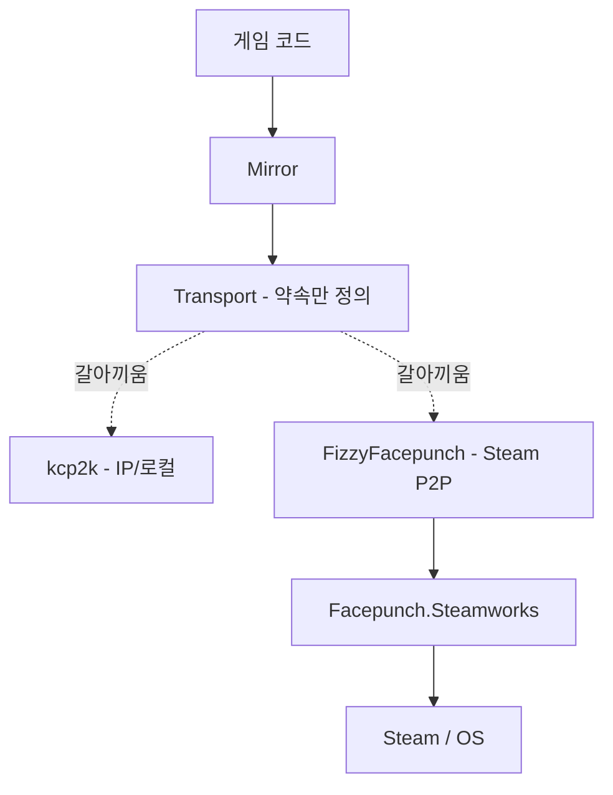

코드의 정적 구조에 대해 먼저 설명하겠습니다. 앞서 설명한 Mirror와 Facepunch의 연장선입니다. 위로 갈수록 게임에 가깝고(고수준, Mirror), 아래로 갈수록 하드웨어에 가깝습니다.(저수준, Transport). 게임 코드는 Mirror만, Mirror는 `Transport` 추상 타입(Transport라는 약속, 인터페이스!)까지만, `FizzyFacepunch`는 `Facepunch.Steamworks`까지만 알고 그 아래는 알지 못합니다. 이러한 분리를 통해 `Transport` 자리에 무엇을 꽂느냐에 따라 통신 방식이 결정됩니다.

이 프로젝트에서는 이러한 `Transport`의 방식을 이용하여 FizzyFacepunch(Steam P2P)와 kcp2k(IP/로컬) 모두를 지원하고 있습니다.

2. 연결 수립 흐름 (게임 시작 전)
> 물리적으로 떨어진 PC들이 Steam에서 인증·로비를 거쳐, SteamID를 주소 삼아 P2P로 하나의 네트워크 세션에 묶습니다.

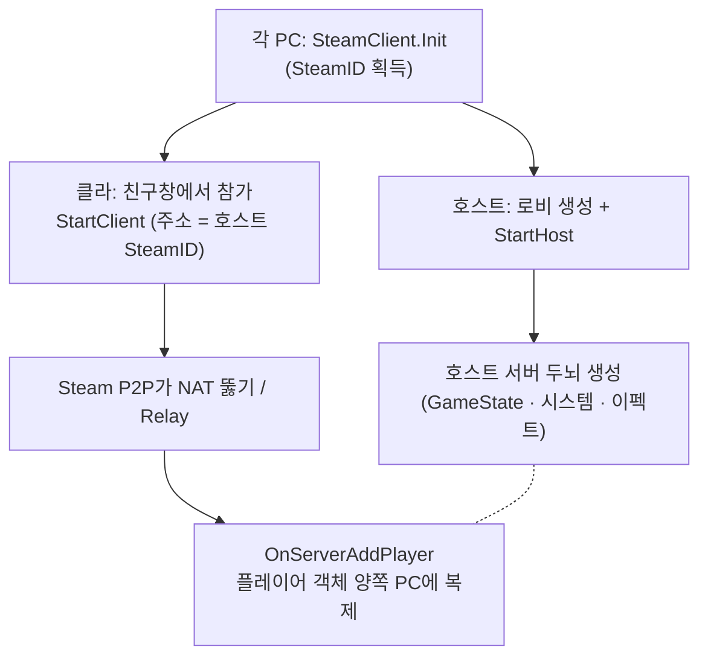

각 PC는 독립적으로 부팅하여 `SteamClient.Init`으로 Steam에 인증하고 각자의 SteamID를 얻습니다. 이후 모든 연결의 *주소*는 **IP가 아닌 SteamID**로 설정됩니다. 호스트는 SteamMatchmaking.CreateLobbyAsync(3)로 로비를 만들고, StartHost()로 Mirror를 호스트 모드(서버+플레이어 겸임)로 띄웁니다. 이 시점에 Mirror가 자동으로 호출하는 OnStartServer() 콜백이 두 단계로 작동합니다. (이런 On... 이름들은 Mirror가 특정 시점에 자동으로 불러주는 콜백 함수입니다.)

 1. `GameNetworkManager.OnStartServer()`가 `NetworkGameController`를 스폰
 2. 스폰된 `NetworkGameController` 자신의 `OnStartServer()`가 `InitializeServerLogic()`을 호출해 서버에만 존재할 게임의 실질적 두뇌(`GameState`·`시스템`·`이펙트 등록`)를 생성

클라이언트는 친구창에서 참가 시 `OnLobbyEntered`에서 `networkAddress`에 호스트 SteamID를 넣고 `StartClient()`를 호출하며, Transport가 이를 SteamID로 해석해 Steam P2P가 NAT을 뚫거나 Relay로 우회해 연결을 성사시킵니다. 연결되면 `OnServerAddPlayer()`가 플레이어 프리팹(`GamePlayer` + `LobbyPlayerState`)을 스폰하고, 이 객체가 양쪽 PC에 복제되며 연결된 PC들이 하나의 세션으로 구성됩니다.

현재 이러한 방식은, 호스트가 서버+플레이어 이므로 호스트 측에서 게임 데이터를 조작하거나 수정해버리면 이를 방지할 방법이 구축되어 있지 않으며, 호스트가 게임에서 나갈 경우 게임 세션이 강제 종료되는 한계가 존재합니다.

3. 로비 → 인게임 세션 셋업
> 모든 플레이가(호스트 제외) 준비가 끝나면 서버 주도로 인게임 씬으로 전환하고, 덱 제출·좌석 배정을 거쳐 게임 로직이 초기화됩니다.

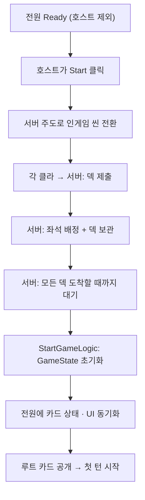

로비에서 각 플레이어는 `CmdSetReady(true)`로 준비 상태를 알리고 그 값은 `SyncVar`로 공유됩니다. 호스트를 제외한 전원이 준비 되었다면, 그리고 호스트가 Start 버튼을 눌렀다면 서버가 `ServerChangeScene("05_InGame")`으로 모든 클라이언트를 동시에 인게임 씬으로 전환합니다. **이때 씬 전환은 서버가 주도합니다!!!**
인게임 진입 후 진행되는 흐름은 다음과 같습니다.
 1. 각 클라이언트가 CmdSubmitDeckData()로 자기 덱을 서버에 제출합니다.
 2. 서버는 RegisterPlayer()로 좌석 번호를 배정(SyncVar)하고 덱을 보관합니다.
 3. 서버는 WaitForPlayersToStartGame 코루틴(중간에 멈췄다 재개되는 함수)으로 모든 덱이 도착할 때까지 대기합니다.
 4. 모든 덱이 모이면 `StartGameLogic()`을 실행해 `ServerGameState`를 초기화하고, 카드 상태(`SyncFullGameState`)와 UI 초기화(`RpcInitializeGameUI`)를 전원에 전파한 다음 루트 카드를 공개하고 첫 턴을 시작합니다.

4. 인게임 통신: 상태 동기화 vs 원격 호출
> 인게임 통신은 "변수를 감시하는 상태 동기화"와 "함수를 원격 실행하는 원격 호출(RPC)" 두 메커니즘으로 나뉩니다.

게임 진행 중의 모든 통신은 성격이 다른 두 메커니즘 중 하나에 속하여 진행됩니다. 편의상 메커니즘 A와 메커니즘 B로 부르겠습니다.

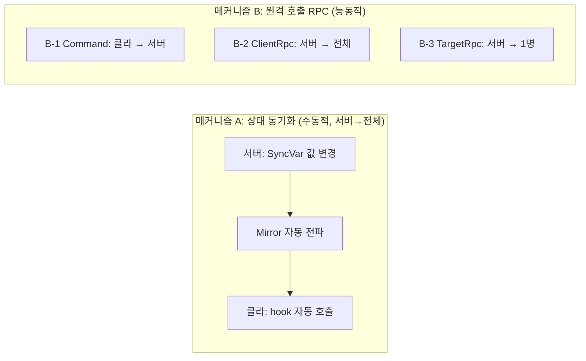

메커니즘 A - 상태 동기화: `SyncVar`·`SyncList`는 변수·리스트를 **감시**하는 장치입니다. 서버가 `CurrentRound`나 `SyncCards`의 값이 바뀌면 Mirror가 자동으로 dirty 처리해 전파합니다. 함수 호출이 아닌, 값의 변화 자체가 통신이라 **수동적이고, 언제나 서버 → 전체 단방향**으로 이루어집니다. 클라이언트에서는 hook과 Callback이 발화해 화면을 갱신합니다.
> 예: 서버에서 CurrentRound가 3→4가 되면, 모든 클라가 함수 호출 없이 자동으로 4를 받습니다.

메커니즘 B - 원격 호출(RPC): 원격 컴퓨터의 함수를 실제로 실행하는 능동적 통신이며 방향에 따라 셋으로 나뉩니다.
  B-1 | `Command`: 클라이언트 → 서버, 행동 요청
  B-2 | `ClientRpc`: 서버 → 전체, 일회성 통보
  B-3 | `TargetRpc`: 서버 → 특정 1명, 개별 지정
> 예: 플레이어가 카드 공개 버튼을 누르면 → Cmd_RevealCard(id)가 서버에서 실행됩니다.

플레이어의 입력은 B-1로 서버에 도달하고, 서버가 검증·처리해 `ServerGameState`를 바꾸면 그 결과는 메커니즘 A로 전원에 자동 반영됩니다. 만일 일회성이라면 B-2를, 특정 플레이어의 선택이라면 B-3으로 끼워넣습니다. 따라서 **모든 결정은 서버에서만 내려지고 클라이언트는 요청(B-1)과 표시(A)만 담당합니다.**

5. 비동기 입력 브릿지
> TaskCompletionSource로 RPC 왕복을 await 한 줄로 바꿔, 서버 이펙트가 플레이어 입력을 기다렸다가 정확히 그 지점에서 재개합니다.

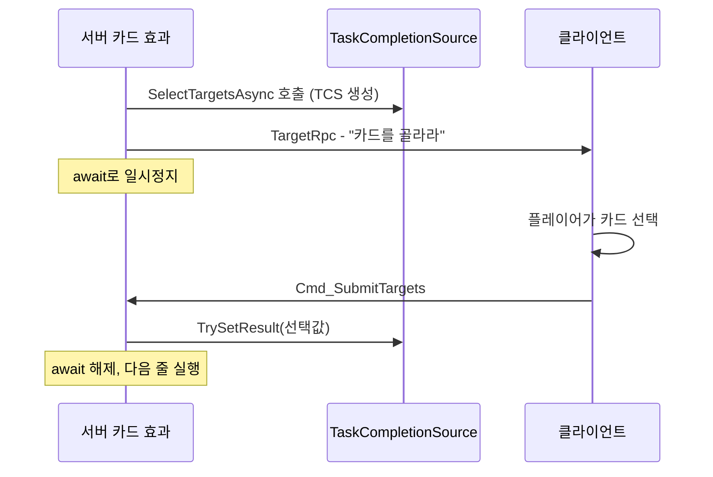

await는 어떤 일이 끝날 때까지 함수 실행을 잠시 멈춰두는 키워드입니다. 서버의 카드 효과 실행기(`EffectRunner`)는 `async/await`로 한 줄씩 진행됩니다. 이는, 카드 효과 중 '파괴/희생할 카드를 선택'과 같이 플레이어가 *타겟*을 골라야 계속 진행되는 지점이 있기 때문입니다. 당연히 해당 플레이어는 다른 PC에 존재하고, 응답 시점을 알 수 없으므로 서버 로직은 **해당 플레이어의 입력이 올 때 까지 멈췄다가 응답이 오면 재개해야 합니다.**

이를 작동하게 만들어주는 것이 `TaskCompletionSource`로, 완료 시점을 직접 제어하는 Task입니다. 보통의 Task는 완료 시점이 자동으로 정해지지만, TaskCompletionSource는 우리가 직접 '이제 끝났어'를 알릴 수 있는 Task입니다. 작동 방식은 다음과 같습니다.
  1. 서버 효과가 `await SelectTargetsAsync()`를 호출하면 `TaskCompletionSource`가 생성되어 플레이어별 상태에 저장됩니다.
  2. 해당 플레이어에게만 `TargetRpc` (B-3)가 발사됩니다.
  3. 서버는 이 시점에서 `await`으로 일시정지하고, B-3를 받은 플레이어는 선택 UI가 띄워지고, 이를 플레이어가 고르면 `Cmd_SubmitTargets()` (B-1)로 응답합니다.
  4. 서버는 이를 받아 `ReceiveTargetResponse()`에서 `tcs.TrySetResult()`를 호출하고, 이 순간 서버는 일시정지를 해제합니다.

카드 효과 코드를 짤 때, 개발자는 `await SelectTargetsAsync(...)` 한 줄만 쓰면 되고, 그 뒤의 네트워크 처리는 신경 쓸 필요가 없게 설계했습니다. 특히 이 부분에서 공을 많이 들였는데, 이유는 '확장성'과 '개발 편의성'에 있습니다. 기획자가 새로이 요구하는 새로운 효과들을 구현할 때, 네트워크에 엮여있으면 기능 하나를 구현하는데 시간이 많이 걸릴 것은 불보듯 뻔했습니다. 그래서, 이 부분에서는 적어도 카드 효과를 작성할때는 네트워크를 전혀 의식하지 않을 수 있게 구현했습니다.

6. 게임종료
> 승패 판정 결과를 SyncVar 두 개로 전원에 전파하고, 서버 주도로 로비에 복귀합니다.

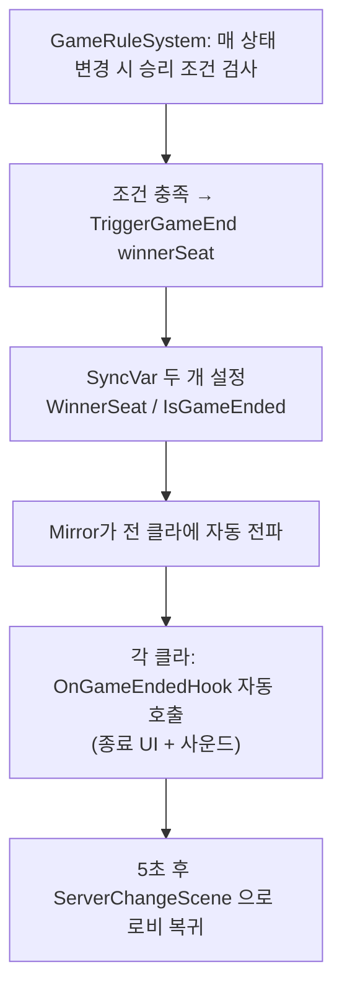

서버의 `GameRuleSystem`은 게임의 상태가 바뀔 때마다 승리조건을 판정합니다. 조건이 충족되면 `TriggerGameEnd(winnerSeat)`가 호출되고, 여기서 종료 전파를 `SyncVar` 두 개(`WinnerSeat`·`IsGameEnded`)로 처리합니다. 서버가 이 값을 설정하면 Mirror가 모든 플레이어에게 자동으로 전파하고, 각 클라이언트의 `OnGameEndedHook()`이 발화해 게임 종료 UI와 승/패 사운드를 재생합니다. 마지막으로 서버는 5초 후 `ServerChangeScene("03_Lobby")`로 전원을 로비로 되돌립니다.

<br>

---

<br>

## Ⅲ. 핵심 기능 및 구현 로직 (Core Features)

### 용어 설명
> **Cultist**: 게임의 신도 수를 나타냅니다. 필드에 놓인 카드가 뒷면으로 존재하면 이를 '신도 카드'라고 합니다. 필드에 뒷면으로 존재하는 동안 해당 신도 수 만큼 플레이어에게 신도가 추가되며, 신도수가 0이 되면, 게임에서 즉시 패배합니다. 카드를 뒤집기 위해서는 해당 카드의 신도수 만큼 신도수가 차감됩니다. 따라서, *필드에는 최소 한 장 이상의 카드가 뒷 면으로 존재해야합니다.*
> 
> **Junction/Split**: 분기점을 나타냅니다. 인게임 상에서는 Split 키워드로 사용되며, 해당 카드의 자식 노드가 2개 이상이 될 수 있음을 나타냅니다.
> 
> **Sect**: 한 카드의 종파는 해당 카드의 직계 부모 라인과 모든 자식을 뜻합니다.
> 
> **SymbolR/SymbolG**: 카드를 공개하기 위해 필요한 심볼/카드가 공개되면 받는 심볼을 뜻합니다. 심볼은 소비 자원이 아닙니다.
> 
> **Reveal**: 뒤집힌 카드를 조건 혹은 효과에 의해 '앞면'으로 공개합니다. 이때, 효과가 발동됩니다.
> 
> **Destroy**: 상대의 카드를 파괴합니다. 파괴된 카드는 교역소에 복사본이 생성됩니다.
> 
> **Exile**: 상대의 카드를 제외합니다. 제외된 카드는 교역소에 복사본이 생성되지 않습니다.
> 
> **Sacrifice**: 자신의 필드에서, 카드를 한 장 희생합니다. 파괴와 메커니즘은 같지만, 타겟이 자기 자신입니다.
> 
> **Echo**: 상대의 카드 효과로 파괴된다면, 파괴되는 대신 공개되는 효과입니다.
> 
> **Crisis**: 상대의 카드 효과로 파괴된다면, 게임에서 제외됩니다.
> 
> **IsRoot**: Root 카드 여부를 나타냅니다. 모든 카드의 시작점이며, 트리로 따지면 root node와 동일한 역할을 합니다.
> 
> **IsForceSelect**: 카드 가져오기 단계(교역 X)에서 강제로 선택되는 효과입니다.
> 
> **IsRevealImmediately**: 카드를 내려놓자마자 즉시 공개되는 효과입니다.

<br>

---

<br>

### Chapter 1. 게임 상태 모델
> 불변 데이터 `Card`, 런타임 `CardInstance` 그리고 서버 주도 `GameState`

<br>

---

<br>

#### [`Card.cs`](./Scripts/Domain/Entities/Card.cs)
> DB에서 로드되는 불변 카드 정의(이름·상징·효과 텍스트 등)

카드 *종류* 자체의 원본 데이터입니다. JSON으로 작성된 카드 DB에서 로드되어, 게임 내내 같은 종류의 카드라면 모두 이 인스턴스 하나를 공유합니다.

가지고 있는 것은 크게 세 부류입니다.

1. **식별 정보**: `Id`, `Name`, `Description`, `Effect`
2. **수치**: `Cultist`(신도), `Junction`(연결 가능 수), 상징 배열 `SymbolR`/`SymbolG`
3. **규칙 플래그**: `IsRoot`, `IsRevealImmediately`, `IsEcho`, `IsCrisis`, `IsForceSelect`, `IsCollectible` 등

모든 필드는 생성자에서만 채워지고 외부 변경 경로가 없습니다(`{ get; }` 또는 `private` *백킹 필드* (프로퍼티 뒤에 숨은 실제 변수)). 상징 배열도 `Clone()`해서 보관하고 외부에는 `IReadOnlyList<int>`로만 노출합니다. 이를 통해 외부 코드가 받은 리스트를 휘저어도 원본은 안전합니다.

`Card`는 카드 *종류*만 표현할 뿐, "이 카드가 지금 누구의 손에 있는가" 같은 런타임 상태는 일절 가지지 않습니다. 그 자리는 다음에 설명할 `CardInstance`가 채웁니다.

<br>

---

<br>

#### [`CardInstance.cs`](./Scripts/Domain/Entities/CardInstance.cs)
> 게임 중 생성되는 런타임 카드 - 소유자·존·상태를 가짐

게임 중 생성되는 런타임 카드입니다. 어떤 카드 종류인지(`CardId`)와 게임 내 고유 식별자(`InstanceId`)를 함께 가지며, 서버는 이 `InstanceId`로 카드 한 장 한 장을 통제합니다.

설계상 `CardInstance`는 무거운 Card 객체를 직접 보관하지 않고 가벼운 `int`인 `CardId`만 들고 있습니다. 실제 카드 정의가 필요한 순간에야 `BaseData` 프로퍼티가 `CardCatalog`(`CardId` → `Card` 조회)를 통해 *지연 조회*(필요할 때만 꺼내오는 방식)합니다. 덕분에 네트워크 동기화 시에도 무거운 객체 대신 `int` ID만 오가게 되어, 통신·로직 부담을 최소화했습니다.

```csharp
public int InstanceId { get; }
public int CardId { get; private set; }
public Player OwnerSeat { get; private set; }

public Zone Zone { get; private set; }
public CardStatus CardStatus { get; private set; }

public Card BaseData => CardCatalog.Instance.Get(CardId);
```

<br>

---

<br>

#### [`IdGenerator.cs`](./Scripts/Utils/IdGenerator.cs)
> 덱 데이터를 인스턴스 ID가 부여된 `CardInstance`로 변환

앞에서 설명했듯, 카드는 그 자체만으로 서버에서 사용되기에는 무겁고, '누구의' 카드인지 구별할 수 없기에 `CardInstance`를 사용합니다. 그리고 이 `CardInstance`가 가지는 고유한, 겹치면 안되는 고유값인 InstanceId를 생성해주는 `static class`입니다. 각 플레이어의 Index를 굳이 나눈 이유는 여기에 있습니다. 플레이어 1이라면 100부터, 2라면 200부터, 3이라면 300부터 시작하는 ID 값을 가지게 됩니다. 100 200 300을 각각 root 카드로 설정하고, 남은 카드들에 고유 ID를 붙여 관리하고 있습니다.

<br>

---

<br>

#### [`GameState.cs`](./Scripts/Domain/State/Host/GameState.cs)
> 서버가 단독으로 소유·관리하는 게임 전체 상태

게임의 모든 상태가 이 한 클래스에 저장되어 있습니다. 카드 인스턴스, 플레이어 상태, 필드 상태, 각종 덱(플레이어 개별 덱·교역·사기사), 라운드별 행동 기록까지 **게임이 지금 상태**를 기록하는 클래스입니다. 이 객체는 오직 **서버(호스트)에서만 생성**되며, 클라이언트는 그 복제본만 받습니다. 서버 권위 모델의 중심이 되는 아주 중요한 클래스입니다.

이 클래스는 다음 두 가지에 초점을 두어 설계했습니다.
1. **모든 카드를 `InstanceId`로 찾을 수 있는 중앙 등록소**를 두었습니다. 카드가 덱에 있든 필드에 있든 교역소에 있든, 생성 시점에 `_cards` 딕셔너리에 등록되므로 `GetCard(instanceId)` 한 번이면 O(1)로 어떤 카드든 찾습니다. `CardInstance`에서 언급한 "서버는 `InstanceId`로 카드를 통제한다"의 실체가 바로 이 딕셔너리입니다. (카드 *종류* 조회인 `CardCatalog`와는 별개의 경로입니다.)
2.  **어떤 카드·플레이어가 게임에 존재하는지를 외부에서 함부로 바꾸지 못하게 캡슐화**(내부 데이터를 외부로부터 가리는 것)했습니다. 내부 컬렉션은 전부 `private`이고, 외부에는 `IReadOnlyList`·`IReadOnlyDictionary`(*읽기만 허용하고 수정은 막는 읽기 전용 뷰*) 또는 조회 메서드로만 노출합니다. 컬렉션 구성을 바꾸려면 반드시 `AddPlayer`·`RegisterCard`·`RecordAction` 같은 정해진 메서드를 거쳐야 합니다. 이는 만일 클라이언트가 쉽게 접근 가능한 자신의 DB json을 수정해서 게임을 망칠 수 있기에, 상태의 원본은 통제된 경로로만 변한다는 원칙을 코드 구조로 강제한 것입니다.

또한 카드 효과 시스템에는 `GameState` 전체가 아니라 `IEffectGameState` 인터페이스만 노출합니다. 이를 통해 상태를 *읽고 질문*할 수 있어도(`GetPlayerStat`, `GetHistoryCount` 등) 내부 구조에 직접 손대지는 못합니다.

```csharp
// 모든 카드의 중앙 등록소: InstanceId로 O(1) 조회
private readonly Dictionary<int, CardInstance> _cards = new();
public IReadOnlyDictionary<int, CardInstance> Cards => _cards;   // 외부엔 읽기 전용 뷰만

public CardInstance? GetCard(int instanceId)
    => _cards.GetValueOrDefault(instanceId);

// 플레이어 상태도 동일. 내부는 private, 외부는 읽기 전용
private readonly List<PlayerState> _players = new();
public IReadOnlyList<PlayerState> Players => _players;
```

<br>

---

<br>

#### [`PlayerState.cs`](./Scripts/Domain/State/PlayerState.cs)
> 플레이어별 상태(신도·심볼·필드·손패·생존 여부)

각 플레이어의 상태를 나타냅니다. 이 플레이어가 가질 수 있는 최대 종파 개수를 정의하며, 플레이어의 *다음 카드 가져오기 단계 규칙*에 대한 정보를 가지고 있습니다.

TurnSystem은 GameState에서 턴 주인의 PlayerState를 조회하고, 그 데이터를 바탕으로 게임을 진행합니다.

```csharp
public void SetNextDrawRule(DrawRule drawRule)
{
    NextDrawRule = drawRule;
}

public DrawRule ConsumeDrawRule()
{
    var rule = NextDrawRule ?? DrawRule.Standard;
    NextDrawRule = null;
    return rule;
}
```

<br>

---

<br>

#### [`DeckCollection.cs`](./Scripts/Domain/Structure/Deck/DeckCollection.cs)
> 덱 카드 순서를 다루는 LIFO 컬렉션

오직 Deck을 다루는 **LIFO**(*Last In, First Out*; 가장 마지막에 들어간 것이 가장 먼저 나오는 스택과 같은 구조) 컬렉션입니다. `IEnumerable<CardInstance>` 인터페이스를 통해 CardInstance들을 foreach로 순회할 수 있다는 계약을 명시하고있습니다. 이를 통해 `DeckCollection`에서 `foreach`를 통해 CardInstance를 호출할 수 있습니다.

1. **foreach 사용 가능**: `foreach (var c in deck)`
2. **LINQ 전체 사용 가능**: `.Where()`, `.Select()`, `.Count()`, `.FirstOrDefault()`, `.Any()` … 이 모든 LINQ 메서드는 `IEnumerable<T>`에 대한 *확장 메서드*(이미 정의된 타입에 새 메서드를 덧붙이는 C# 기능)라서, 구현하는 순간 전부 켜집니다.

`DeckCollection`은 이렇게 `CardInstance`들을 LIFO로 관리하고, 카드 게임에서 덱 사용에 필요한 모든 로직을 수행하고 있습니다. 하지만, 게임의 System들에서 이를 직접 호출하고 사용하지 않습니다.

`DeckCollection`은 기본적으로 C++에서 제공하는 algorithm 자료형을 본따서 만들었습니다. 즉, `DeckCollection`을 직접적으로 사용하는게 아니라, 이 자료구조를 바탕으로 이어서 나올 `DeckState`에서 이를 사용하고 있습니다.

<br>

---

<br>

#### [`DeckState.cs`](./Scripts/Domain/State/DeckState.cs)
> 플레이어별 덱 - DeckCollection을 감싸는 façade

*façade*는 디자인 패턴 중 하나로, **복잡한 내부 자료구조를 외부에 숨기고 의도가 드러나는 좁은 API만 노출**하는 역할을 뜻합니다.

플레이어의 덱은 `DeckCollection`이라는 LIFO 컬렉션으로 관리되며, `DeckState`는 그 컬렉션을 감싸 플레이어 단위 덱 상태를 표현합니다.

Root 카드를 설정하고, `GameActionSystem`과 `TurnSystem` 그리고 `DrawCommand`에서 `DeckState`의 내부 함수를 호출해 카드를 뽑거나, 추가하는 등의 로직을 수행합니다.

<br>

---

<br>

#### [`FieldTree.cs`](./Scripts/Domain/Structure/Field/FieldTree.cs)
> 필드를 다루는 Tree 컬렉션

오직 PlayerField를 다루는 Tree 컬렉션입니다. 이 Tree의 경우, 다음의 구조 규칙을 가지고 있습니다.

1. 모든 노드는 부모가 하나다
2. `ChildrenInstanceIds` 목록과 실제 부모-자식 관계가 일치해야 한다
3. `Nodes` 딕셔너리(`InstanceId` → `FieldNode`)이 트리 실제 구성과 어긋나면 안 된다
이 때문에 `FieldTree`의 `AddNode`·`GetAncestors`·`GetDescendants`는 이 규칙이 항상 참이라고 믿고 동작합니다. 그런데 누군가 `FieldTree`를 상속해서 `AddNode`를 다른 동작으로 바꾸면, 이 규칙이 깨지는 순간 이를 읽는 핵심 코드들, `StatSystem`부터 `NetworkGameController.SyncFullGameState`까지의 모든 계산이 틀린 값을 내게 됩니다. 이걸 입구에서 막기 위해 `sealed`(*이 클래스를 상속하지 못하게 막는 C# 키워드*)로 잠갔습니다. 필드 트리는 앞으로도 다른 변형이 필요할 일이 없으므로, 확장성을 포기하는 대가도 없었습니다.

동일한 이유로, 대부분의 도메인 상태·자료구조의 경우 거의 다 `sealed` 처리해두었습니다.

자료구조가 가져야 할 기본 덕목들은, 거기에 이 프로젝트에서 필요한 연산은 모두 구현해두었습니다. 기본적으로 필드 트리를 생성하고, 노드를 추가하거나 받아오고, Sect 조회 로직에 사용할 탐색 로직들을 구현했습니다.

<br>

---

<br>

#### [`FieldNode.cs`](./Scripts/Domain/Structure/Field/FieldNode.cs)
> 필드 트리의 노드(부모·자식 관계)

FieldTree에 들어가는 Node입니다. 자기 자신의 `InstanceId`와 자신의 부모 `ParentInstanceId`, 자식인 `ChildrenInstanceIds`를 가지고 이를 관리합니다.

<br>

---

<br>

#### [`FieldState.cs`](./Scripts/Domain/State/FieldState.cs)
> 플레이어별 필드 - FieldTree를 감싸는 façade

플레이어가 필드에 펼친 카드는 `FieldTree`라는 트리 구조로 관리되며, FieldState는 그 트리를 감싸 플레이어 단위 필드 상태를 표현합니다. 이 클래스는 초기 설계를 한 번 바로잡은 부분입니다.

처음에는 `FieldState`를 façade로 의도했지만, 실제로는 `GetFieldTree()`로 내부 `FieldTree`를 그대로 반환하고 있었습니다. 래퍼가 자기 내부 객체를 외부에 넘기는 순간 캡슐화는 이름뿐이 됩니다. 트리를 받은 쪽은 무엇이든 할 수 있고, 실제로 대부분의 시스템이 `FieldState`를 건너뛰고 raw FieldTree를 직접 조작했습니다. `FieldState` 자신의 메서드는 호출되지 않는 죽은 코드가 됐습니다.

```csharp
// Before
public FieldTree GetFieldTree()
{
    return PlayerFieldTree;
}
```

원인은 같은 도메인의 `DeckState`와 비교했을 때 분명해졌습니다. `DeckState`는 내부 `DeckCollection`을 `private`으로 끝까지 숨겨, 누구도 자료구조에 직접 닿지 못하게 합니다. 두 클래스가 같은 의도(State가 자료구조를 감싼다)였는데, 한쪽만 그 의도를 지키고 있었던 것입니다.

그래서 `FieldState`를 진짜 façade로 재설계했습니다. `GetFieldTree()`를 제거해 `FieldTree`를 완전히 내부로 숨기고, 호출자에게 실제로 필요한 연산만 의도가 드러나는 메서드로 노출했습니다. `GameState`에서도 raw 트리를 넘기던 `GetFieldTreeById()`를 걷어내고 `GetFieldStateById()`로 경로를 일원화했습니다. 이제 필드 조작은 반드시 `FieldState`를 거치며, `DeckState`와 캡슐화 수준이 대칭을 이룹니다.

이렇게 다시금 리팩토링을 하는 과정에서, *래퍼 계층은 "존재 이유"를 벌어야 한다. 내부 객체를 그대로 반환하는 래퍼는 아무것도 보호하지 못한다. State는 자료구조를 숨기고, 외부에는 의도가 드러나는 좁은 API만 줄 때 비로소 façade가 된다.* 라는 중요한 사실을 학습할 수 있었습니다.

현재는 이와 연계된 모든 코드를 수정 및 관련 오류를 해결했습니다.

<br>

---

<br>

#### [`Phase.cs`](./Scripts/Domain/Enums/Phase.cs)
> 메인/서브 페이즈 열거형 정의

플레이어는 게임에서 크게 3개의 페이즈를 가집니다.

| 페이즈 | 의미 |
| :--- | :--- |
| `StandBy` | 턴이 돌아오기를 기다리는 상태 |
| `Draw` | 카드 가져오기 단계 |
| `Play` | 카드 내려놓기 단계 |

```csharp
public enum Main
{
    StandBy,
    Draw,
    Play,
}
```

`Draw`는 다시 다음과 같이 3개의 상태를 가집니다.

| 서브 상태 | 의미 |
| :--- | :--- |
| `StandBy` | 플레이어의 입력을 기다리는 상태 |
| `Draw` | 덱에서 카드를 가져옴 |
| `Trade` | 교역소에서 카드를 가져옴 |

`Play`는 카드를 내려놓거나 뒤집을 수 있는 공통 상태인 `Play` 상태만을 가집니다.

<br>

---

<br>

#### [`PhaseState.cs`](./Scripts/Domain/State/PhaseState.cs)
> 메인/서브 페이즈 값

플레이어의 Phase는 앞선 `Phase.cs` 내부의 enum들을 바탕으로 `PhaseState`에서 관리합니다. 페이즈 시스템의 골조는 보드게임에서 가져왔습니다. 특히 '엘드리치 호러'라는 게임을 팀원들과 플레이하며, 설명서를 여러 번 읽으며 기반을 다졌습니다.

물론 이 프로젝트는 엘드리치 호러를 비롯한 여타 보드게임과 다르게 페이즈가 복잡하지 않습니다. 하지만 추후 확장성과 페이즈 자체에 영향을 주는 카드도 존재함에 따라, `MainPhase.SubPhase` 형태로 접근이 가능하도록 `GameState`를 비롯한 게임의 System이 플레이어의 현재 동작을 이 페이즈로 구분할 수 있도록 구현했습니다.

`PhaseState`의 한 인스턴스는 *현재 페이즈*를 `(Main, Sub)` 좌표 하나로 표현합니다. 가령 지금이 Draw 단계의 Trade 스텝이라면 내부적으로 `Main = Draw, Sub = 2`로 다뤄집니다.

`PhaseState`는 `class`가 아니라 **`readonly struct`** 입니다. 값 타입이라 가볍고, 불변이라 페이즈를 바꾸려면 새 인스턴스로 교체해야 합니다. 의도치 않은 수정이 일어날 여지를 구조적으로 차단했습니다.

```csharp
// 불가능: 컴파일 에러
turnState.Phase.Sub = 2;

// 가능: 새 인스턴스로 교체
turnState.Phase = PhaseState.From(Phase.Draw.Trade);
```

`Sub`를 enum이 아니라 `int`로 둔 이유는 단계마다 하위 스텝의 enum 타입이 다르기 때문입니다. `Phase.Draw`(StandBy/Draw/Trade)와 `Phase.Play`(Play)는 서로 다른 타입이라 한 필드에 같이 담을 수 없었습니다. 그래서 두 enum의 공통 표현인 `int`로 통합하고, 외부에서 `PhaseState`를 만드는 길은 `From` 메서드 오버로딩으로만 열어 잘못된 값이 들어올 길을 입구에서 막았습니다.

```csharp
public static PhaseState From(Phase.Draw step) => new PhaseState(Phase.Main.Draw, (int)step);
public static PhaseState From(Phase.Play step) => new PhaseState(Phase.Main.Play, (int)step);
```

생성자는 `private`이라 외부에서 `new PhaseState(...)`를 직접 호출할 수 없고, 다음 세 경로만 허용됩니다.

```csharp
PhaseState.StandBy                       // (Main=StandBy, Sub=-1)
PhaseState.From(Phase.Draw.Trade)        // (Main=Draw,   Sub=2)
PhaseState.From(Phase.Play.Play)         // (Main=Play,   Sub=0)
```

`From`은 인자의 enum 타입으로 `Main`을 자동 결정합니다. `Phase.Draw`를 넘기면 Main=Draw, `Phase.Play`를 넘기면 Main=Play. 호출자는 `Main`을 명시할 필요가 없고, `(Main=Draw, Sub=Phase.Play.Play값)` 같은 모순된 조합은 만들 길이 없습니다. **즉, '만드는 길'을 좁혀서 잘못된 조합을 만들 수 없게 한 것입니다.**

`StandBy`는 하위 스텝이 없으므로 `Sub = -1`을 *센티넬*(특별한 의미를 가진 약속된 값; 여기선 -1이 'Sub 없음'을 뜻함)로 사용합니다.

`PhaseState`는 빈번하게 비교됩니다. 자연스러운 `==` 사용과 `Dictionary` 키 활용을 위해 비교 메서드들을 직접 구현했습니다. *struct는 기본 비교가 모든 필드를 리플렉션으로 훑어 느린데, 직접 구현하면 두 정수만 비교해서 끝납니다.*

```csharp
public bool Equals(PhaseState other) => Main == other.Main && Sub == other.Sub;
public override int GetHashCode() => HashCode.Combine(Main, Sub);
public static bool operator ==(PhaseState a, PhaseState b) => a.Equals(b);
public static bool operator !=(PhaseState a, PhaseState b) => !a.Equals(b);
```

마지막으로, `PhaseState`는 *"지금 어디인가"* 만 표현할 뿐 페이즈를 *전환*하는 책임은 `PhaseSystem`에 있습니다. 도메인 데이터와 시스템 로직의 분리 원칙을 일관되게 따랐습니다.

부수효과로, `Sub`가 이미 `int`라 `NetworkGameController`가 `SyncVar`로 페이즈를 전 클라이언트에 보낼 때 `(Main, Sub)`를 두 `int`로 그대로 쪼개 보낼 수 있습니다.

<br>

---

<br>

#### [`TurnState.cs`](./Scripts/Domain/State/TurnState.cs)
> 활성 플레이어·라운드·턴 순서

'자신의 턴'이 활성화된 플레이어, 현재 라운드, 턴 순서를 보관하는 클래스입니다. 대부분은 단순 상태값이지만, RemainingCycles 하나에는 설계 판단이 담겨 있습니다.

이 게임은 보드게임을 베이스로 해 '행동의 반복'이 잦습니다. "카드 가져오기를 n번 반복", "교역을 한 번 더 진행" 같은 카드 효과가 많습니다. 초기에는 이를 게임 `Phase`를 되돌리는 방식으로 구현했는데, 페이즈가 꼬이고 드로우·교역이 막히며 라운드 카운팅 버그가 반복됐습니다. 원인은 하나였습니다. `Phase`는 "턴 안에서 지금 어디인가" 를 나타내는 값인데, 거기에 "턴을 몇 번 더 반복하는가" 라는 별개의 개념까지 떠맡긴 것이었습니다. 한 메커니즘이 두 책임을 겸하니 충돌이 났습니다.

그래서 반복 횟수를 `RemainingCycles`라는 독립된 값으로 분리했습니다. 한 턴에 수행 가능한 사이클(Draw → Play)이 몇 번 남았는지를 뜻하며, 표준은 1회, Stonehenge 같은 효과가 이 값을 늘립니다. 이제 `Phase`는 "턴 내 위치"만, `RemainingCycles`는 "반복"만 책임지므로 두 로직이 서로 간섭하지 않습니다. 이 분리는 뒤에 설명할 DrawRule과도 잘 맞물립니다.

<br>

---

<br>

#### [`GameActionRecord.cs`](./Scripts/Domain/History/GameActionRecord.cs)
> 행동 로그 - 조건 판정 시 과거 기록 조회용

GameActionRecord 시스템은 라운드별 행동 로그를 보관해, '한 라운드에 N번 무언가 했을 때'라는 조건을 기획자가 JSON으로 표현할 수 있게 합니다. 32번 카드는 'Destroy 1회 이상'을 통해 정상 작동했지만, 31번 카드의 'Trade 3회 이상' 조건은 `GameActionSystem.Trade()`에 `RecordAction` 호출이 빠져 있어 카드가 기획 의도대로 발동하지 않는 상태였습니다. 코드를 점검하며 발견한 갭으로, 한 줄 추가로 해결했습니다.

```csharp
if (selected != null)
{
    CardMovementSystem.MoveCard(_gameState, selected.InstanceId, player, Zone.Hand, CardStatus.Hand);
    _gameState.RecordAction(player, ActionType.Trade, targetPlayer: null, cardId: selected.CardId);  // ← 추가
    Debug.Log($"[Trade] {selected.BaseData.Name} 교역 완료");
}
```

<br>

---

<br>

#### [`DrawRule.cs`](./Scripts/Domain/Policies/DrawRule.cs)
> 드로우 방식 정책(표준/지정 등)

`Chapter 1`에서 설명하는 코드 중, Phase 시스템과 더불어 가장 공들여 만든 코드입니다. 초기 제작 단계에서 Effect 효과를 구현하는 과정에서 가장 어려웠던 것은 게임의 순서와 엮인 카드의 효과를 해결하는 것이었습니다. 앞선 Phase에서 보면 Draw Phase 다음으로 Play Phase가 진행되는데, 그렇다면 Play Phase에서 '카드 가져오기 단계를 한번 더 진행합니다' 와 같이 '다음 카드 가져오기 단계'를 수정한다면 해당 정보를 조금 더 체계적으로 가져올 필요가 있었습니다. 그렇지 않으면 `GameState`에서 별도로 '이 플레이어만 1회 더 진행해'라고 진행한다면 (초기에는 이렇게 진행했습니다) 예기치 못한 상황으로 필드의 페이즈와 턴 시스템이 꼬여버려 **한 플레이어의 턴이 무한히 반복되거나 '선택'이라는 개념의 드로우/교역이 멈춰버리는 현상이 지속적으로 발생했습니다.**

이를 해결하기위해 여러 방법을 모색하던 중, OOP의 기초를 다시금 머릿속으로 생각해보았습니다. 답은 간단했습니다. *복잡한 동작을 데이터 한 묶음으로 표현하면, 그걸 들고 다니며 시스템 어디서든 같은 규칙으로 해석할 수 있게 됩니다.* 복잡한 Draw 로직 자체를 클래스로 만들어서, Rule로 설계하고 턴이 시작될 때 System이 플레이어의 DrawRule을 읽게해서 관리한다면? 이 과정에서 '카드 가져오기 단계를 생략하고 신도가 n인 카드를 뽑는다'와 같이, 플레이어의 선택을 스킵하고 원하는 로직을 진행시킬 수 있게 구성하였습니다.

```csharp
public static DrawRule Standard => new DrawRule
{
    Type = DrawType.Draft,
    SkipSelection = false,
    Amount = 3,
    CardCondition = null
};
```

<br>

---

<br>

#### [`RevealReason.cs`](./Scripts/Domain/Enums/RevealReason.cs)
> 카드 공개 호출 사유

카드의 공개 조건을 나타내는 enum입니다. 추후 카드 효과가 추가되면 이곳에 추가 가능합니다. 추후 Effect 관련 로직에서 자주 사용합니다.

<br>

---

<br>

#### [`DeterministicTreeLayout.cs`](./Scripts/Domain/Structure/Field/DeterministicTreeLayout.cs)
> 필드 시각화 및 드롭존 처리


[라인 테스트 영상](https://youtu.be/THyzJLCemfU)

초기 기획 의도는 '마치 나무 뿌리가 무질서하게 뻗어나가는 느낌으로 필드를 채워 넣고, 그걸 멀리서 바라봤을 때의 심미적인 효과'를 요구했습니다. 이에 맞추어 랜덤하게 카드를 생성하면서도 겹치지 않는 로직을 구현했으나, 이는 기각되었고 결국 '정형화된 카드 필드'와 함께 '카드를 놓는 방식에 따라 모양이 바뀌는 구조'로 정립되었습니다.

우선 이를 구현하기 위한 조건을 생각하며, 스스로 대답해보았습니다.
1. Field는 일정한 간격을 가져야한다.
   Q. 그럼 Vertical Layout Group을 사용할 수 있을까?
   A. 안 된다. VLG는 한 줄로 쌓는 1차원 컴포넌트인데, 필드는 한 부모 밑에 자식이 여러 갈래로 펼쳐지는 트리 구조라 표현이 안 된다. 자식이 1명이면 부모 위로 일직선, 2명 이상이면 좌우 대칭... 이런 트리 특유의 배치 규칙은 자동 LayoutGroup으로 흉내 낼 수 없다.
   그러면? root 카드를 content 영역 중앙에 고정시키고, 그 위로 카드가 추가될 때마다 각 노드의 서브트리 폭을 계산해 일정한 간격으로 깔끔하게 배치되도록 직접 좌표를 결정하면 된다.
2. 그럼 Tree의 레이아웃은 얼마만큼 '자주' 갱신되어야할까?
   카드를 내려놓으면 DropZone이 생성되어 '어디에 카드를 놓을 지' 결정해야한다. 이 때, 전체 트리 모양이 어떻게 변경되는지 미리보기가 되어야한다. → 기획 의도
   그럼 Tree가 갱신되는 조건은?
   1. Dropzone 이 생성될 때 → 다른 주변 모든 카드는, 해당 드롭존에 맞춰서 '넓어'져야함.
   2. 취소해서 카드가 다시 Hand로 돌아오고 DropZone이 사라질때 → 취소하고 원상복구
   3. DropZone을 선택해서 카드가 해당 위치에 부착될 때 → 슬롯이 사라지고 새 카드 한 장이 남으므로, 미리보기 상태보다는 좁아지고 원래 상태보다는 한 자식 폭만큼 넓어진 모양으로 일관되게 재정렬되어야 함.

그럼 메서드 단위로 이를 분석하고 정리해보겠습니다.

**`CalculatePositions(...)`**: 전체 레이아웃 계산을 관리하는 Entry Point입니다. 전달받은 트리를 저장하고, 계산용 딕셔너리를 초기화합니다.

1. **Bottom-Up** (*잎부터 뿌리 방향*): `CalculateSubtreeWidth`를 호출, 자식 노드부터 부모 노드 방향으로 각 서브트리가 차지하는 전체 너비를 계산
2. **Top-Down** (*뿌리부터 잎 방향*): `AssignPositions`를 호출하여 부모 노드부터 자식 노드 방향으로 실제 좌표를 할당

이를 통해, 최종적으로 모든 노드의 좌표가 담긴 딕셔너리를 반환합니다.

**`CalculateSubtreeWidth(int nodeId)`**: 특정 노드를 루트로 하는 서브트리(Subtree)가 가로로 얼마만큼의 공간을 차지하는지 재귀적으로 계산합니다.

| 자식 수 | 동작 |
| :--- | :--- |
| 0명 (Leaf Node) | 자기 자신의 너비(`_cardWidth`)만 반환 |
| 1명 | 자식 노드 위로 직진해서 올라가므로 자식의 너비를 그대로 가져와 반환 |
| 2명 이상 | 모든 자식들의 서브트리 너비를 합산하고, 그 사이사이에 들어갈 여백 `_paddingX`을 더한 총합을 자신의 너비로 결정. 계산된 값은 추후 재연산을 막기 위해 `_subtreeWidths` 캐시에 저장 |

**`AssignPositions(int nodeId, Vector2 pos)`**: 앞서 계산된 서브트리 너비 데이터를 바탕으로, 각 노드의 최종 2D 좌표를 부여합니다. 현재 노드(`nodeId`)에 전달받은 좌표(`pos`)를 최종 타겟 좌표로 저장한 뒤, 자식 수에 따라 분기합니다.

| 자식 수 | 동작 |
| :--- | :--- |
| 1명 | 분기할 필요가 없으므로 부모와 동일한 X축을 유지한 채 Y축 방향으로만 이동하여 자식을 배치 |
| 2명 이상 | 현재 노드에 할당된 전체 공간(`totalWidth`)의 가장 왼쪽 지점(`currentX`)을 계산. 이후 자식들을 순회하며 각 자식이 가진 고유 너비의 '절반' 위치에 중심점을 잡아 균등하고 대칭적으로 자식들을 배치. 하나를 배치할 때마다 `currentX`를 이동시켜 다음 자식의 시작 위치를 갱신 |

<br>

---

<br>

#### [`UICurvedLine.cs`](./Scripts/Domain/Structure/Field/UICurvedLine.cs)
> 필드에 존재하는 카드를 연결하는 CurvedLine

카드를 소환했으니, 그 카드가 '연결' 되어있다는 느낌을 주기 위해서는, 이 '트리'가 정상적으로 연결되어있음을 표시하기 위해서는 '선'이 필요합니다. 이 선은 '곡선' 형태여야하고, 부드럽게 연결되어야합니다.

그럼 메서드 단위로 이를 분석하고 정리해보겠습니다.

**`Awake`**: 현재 객체의 `RectTransform`을 가져와 크기(`sizeDelta`)를 가로세로 20000이라는 매우 큰 값으로 설정합니다. 이는 UI 요소가 화면 밖으로 나갔다고 판단되어 Unity의 UI 시스템에 의해 렌더링이 잘리는(`Culling`) 현상을 방지하기 위해 강제적으로 설정했습니다.

**`DrawCurve(Vector2 startLocalPos, Vector2 endLocalPos)`**: 곡선의 시작점과 끝점을 갱신하고 다시 그리기를 요청하는 메서드입니다. 이전 좌표와 새로 입력된 좌표의 차이(`SqrMagnitude`)가 0.1f 미만이면, 변경 사항이 없다고 판단하여 연산을 취소(`return`)하여 성능을 최적화합니다. 만일 좌표가 변경되었다면, 새로운 점들을 저장하고 `SetVerticesDirty()`를 호출합니다.

**`OnPopulateMesh(VertexHelper vh)`**: UI 그래픽의 실제 정점(`Vertex`) 데이터를 구성하는 핵심 메서드입니다. 동작은 다음과 같습니다.

1. `vh.Clear()`를 통해 기존 메쉬 데이터를 초기화합니다.
2. 곡선을 만들기 위한 4개의 Control Point를 설정합니다.

   | 제어점 | 의미 |
   | :--- | :--- |
   | p0 | 시작점 |
   | p1 | 시작점에서 수직(`curveVerticalForce`)으로 뻗어 나가는 제어점 |
   | p2 | 끝점에서 수직 방향 아래로 내려오는 제어점 |
   | p3 | 끝점 |

3. 이 4개의 점을 바탕으로 설정된 `segments` 개수만큼 반복문을 돌며 곡선 위의 중간 점(Points)들을 계산하여 리스트에 담습니다.
4. 계산된 점들을 순회하며 `CreateLineSegment`를 호출해 실제 선분을 그립니다.

**`CalculateCubicBezierPoint(...)`**: 3차 베지어 곡선 공식에 따라 진행도 $t$ ($0 \le t \le 1$)에 위치한 2D 좌표를 계산합니다. *네 개의 제어점(p0~p3)이 곡선을 정의합니다. p0와 p3는 양 끝점, p1과 p2는 곡선이 어느 방향으로 휘어질지를 결정합니다.*

$$P(t) = (1-t)^3 P_0 + 3(1-t)^2 t P_1 + 3(1-t) t^2 P_2 + t^3 P_3$$


~~오랜만에 풀어봐서 즐거웠다~~

**`CreateLineSegment(...)`**: 두 개의 점(start, end)을 연결하는 두께를 가진 사각형 메쉬(Quad)를 생성합니다. 각각의 방향 벡터(`direction`)를 구한 뒤, 이를 90도 회전시켜 선분의 두께를 결정할 법선 벡터(`normal`)를 계산합니다. 하나의 선분을 그리기 위해 4개의 정점(Vertex)을 생성합니다. 각 정점의 위치는 중심선에서 법선 벡터를 더하거나 빼서 구하고, 텍스처 매핑을 위한 UV 좌표와 색상을 할당합니다. 마지막으로 `vh.AddTriangle()`을 두 번 호출하여 4개의 점을 2개의 삼각형으로 이어 사각형(Quad)을 완성합니다.


[이 Curve Line은 대학생때 배운 Computer Animation에서 Laplician Editing 개념을 상기하며 구성해보았습니다.](https://waterglass0105.tistory.com/67)

<br>

---

<br>

### Chapter 2. 시스템
> 카드 이동, 카드 액션, 카드 필드 그리고 덱 생성과 불러오기

<br>

---

<br>

#### [`CardMovementSystem.cs`](./Scripts/Systems/CardMovementSystem.cs)
> 카드가 이동하는 단일 경로(출발지 제거 → 도착지 추가)

카드의 이동을 담당하는 시스템입니다. 카드 게임, 특히 핸드, 덱, 필드, 교역소로의 이동이 매우 활발하고 자주 이루어지기 때문에 이동간의 에러가 발생하거나 문제가 생기는 경우를 사전에 방지하고자 구현한 시스템입니다.

게임 내에서 지원하는 모든 카드 이동을, 각각에 맞게 모두 지원하고있습니다.

<br>

---

<br>

#### [`GameActionSystem.cs`](./Scripts/Systems/GameActionSystem.cs)
> Draw, Play, Reveal 규칙 관리 시스템

게임의 규칙을 관리하는 시스템입니다.

**[셋업]**

| 메서드 | 역할 |
| :--- | :--- |
| `GameActionSystem(GameState, IPlayerInputProvider)` | `GameState`와 입력 제공자를 주입받아 보관. `StatSystem`도 `GameState`로부터 가져옴 |
| `SetGameRuleSystem` | 승패 판정 시스템 주입. `StatSystem`에도 같이 전달 (순환 참조 피하려고 사후 주입) |
| `SetEffectRunner(EffectRunner)` | 이펙트 실행기 주입. `OnReveal`·`OnHand`·`OnDestroyed` 같은 트리거를 발화시킬 때 사용 |
| `SetTargetResolver(TargetResolver)` | 타겟 해석기 주입. `CardCondition` 기반 드로우 등에서 후보 카드 검색에 사용 |
| `CheckGameRules` | 행동 후 `GameRuleSystem`의 필드/스탯 조건 검사 호출. 승패 갱신 트리거 |

**[드로우]**

| 메서드 | 역할 |
| :--- | :--- |
| `Draw(Player, DrawRule)` | DrawRule을 기반으로 플레이어의 Draw를 처리 |
| `FetchCardAsync(Player, DrawRule)` | 조건부 검색이거나 일반 덱 pop을 통해 카드를 확보. 덱이 비어있다면 사기사 카드 자동 드로우 |
| `ResolveDraftDraw(Player, List<CardInstance>)` | N장 보여주고 1장 선택. 선택된 건 손패로, 나머진 교역소로 |
| `ResolveSimpleDraw(Player, List<CardInstance>)` | Card Effect 중 OnHand 트리거 발화 시 작동. 가져온 카드 전부 손패로 |

**[교역·기아]**

| 메서드 | 역할 |
| :--- | :--- |
| `Trade(Player)` | 교역소에서 카드 1장 선택해 손패로. OnHand 트리거 발화 (앞에서 `RecordAction(ActionType.Trade)` 누락이 이 부분이었습니다. 흑흑... 어쩐지...) |
| `Starve(Player, amount, shuffle)` | 플레이어 덱에 기아 카드 N장 추가하고 셔플 |

**[공개]**

| 메서드 | 역할 |
| :--- | :--- |
| `Reveal(Player, CardInstance, RevealReason)` | 카드 공개의 풀 파이프라인. 카드 효과에 따라 검증을 건너뛰는(Echo) 분기까지 모두 처리 |
| `CheckRevealRequirement(Player, CardInstance)` | 공개 비용 검증 (자살 방지 + 요구 심볼 충족 + JSON 정의 RevealCondition 충족) |
| `CanRevealCard(Player, CardInstance)` | 공개 가능한 상태 검증 (본인 차례 + Play 페이즈 + FieldBack 상태) |

`Reveal`의 내부 단계는 대략적으로 다음과 같습니다.

1. 사유별 검증 우회 (Echo는 비용 우회, Manual은 전부 검사)
2. `IsUniqueReveal` 같은 Feat 제약 검사
3. `CheckRevealRequirement` (비용·조건)
4. `OnRevealCost` 트리거 (비용 지불, Cancel 가능)
5. `CardMovementSystem.MoveCard` → `FieldFront`
6. 사운드·보이스 RPC (사기사는 전체방송, 일반은 본인)
7. `StatSystem.UpdatePlayerStats` + 동기화
8. `OnReveal` 트리거 (Echo면 `isEcho=1` 변수 주입)
9. `CheckGameRules`

**[카드 내려놓기]**

| 메서드 | 역할 |
| :--- | :--- |
| `Play(Player, handCard, parentCard, slotIndex)` | 손패 카드를 필드 트리에 자식으로 삽입. 배치 후 `IsRevealImmediately`가 `true`라면 자동 `Reveal` |
| `CanPlayCard(Player, hand, parent)` | 카드 내려놓기 & 사용하기 검증 (본인 손패/턴/Play 페이즈 + 부모 카드의 Junction 한계 + 플레이어 MaxJunction) |

`Play`의 내부 단계는 대략적으로 다음과 같습니다.

1. `CanPlayCard` 검증
2. `FieldState.GetNodeByInstanceId`로 부모 노드 확보 (없으면 생성. 없다는 건 루트카드라는거~)
3. 새 `FieldNode` 만들어 `InsertChild(slotIndex, ...)`
4. `CardMovementSystem.MoveCard` → `Zone.Field`, `FieldBack`
5. 배치 사운드 RPC
6. `StatSystem.UpdatePlayerStats`
7. `IsRevealImmediately`면 즉시 `Reveal` 호출

**[카드 사용하기]**

| 메서드 | 역할 |
| :--- | :--- |
| `Use(Player, CardInstance)` | 뒷면 카드 혹은 `OnClick` 트리거가 있는 앞면 카드를 클릭했을 때 `OnClick` 트리거 발화 (본인 차례 + Play 페이즈) |
| `CanUseCard(Player, CardInstance)` | 사용 가능 검증을 한 곳에 모아둔 헬퍼 |

**[파괴·추방]**

| 메서드 | 역할 |
| :--- | :--- |
| `Destroy(Player, targetCard)` | 신도 카드 파괴. Echo 분기(다른 플레이어가 `IsEcho` 카드를 파괴 시도하면 파괴 대신 공개). `OnPreDestroy` → 이동 → `OnDestroyed` 트리거. 복제본을 교역소에 추가 (Crisis 제외) |
| `Exile(Player, targetCard)` | 파괴와 거의 동일하되 복제본 생성 안 함. `ActionType.Exile`로 기록. `OnDestroyed` 트리거는 공유! |

`Destroy`의 세부 규칙:

1. 앞면 카드는 파괴 불가 (게임 룰)
2. `IsEcho` 카드를 다른 플레이어가 파괴하려 하면 → `Reveal(RevealReason.Echo)`로 전환
3. `IsCrisis` 카드는 복제본 미생성 (Exile과 동일하게 취급)

**[유틸]**

`IsPlayerAlive(Player)`: `PlayerState.LifeStatus == Alive` 확인. 모든 public 액션의 첫 줄에서 호출하여 **탈락자 액션 차단**.

즉, `Draw`, `Trade`, `Starve`, `Reveal`, `Play`, `Use`, `Destroy`/`Exile`은 다음의 **공통 패턴**을 가지고 설계했습니다.

1. `IsPlayerAlive` 체크 (탈락자 차단)
2. 본인 차례/페이즈 검증 (`Can*Card` 헬퍼)
3. 비용·조건 검증 (특히 `Reveal`)
4. 실제 상태 변경 (`CardMovementSystem` 등)
5. 사운드 RPC
6. `StatSystem` 갱신 + 동기화
7. 관련 트리거 발화 (`OnReveal`, `OnHand`, `OnDestroyed` ...)
8. `CheckGameRules` (승패 판정)

<br>

---

<br>

#### [`FieldSystem.cs`](./Scripts/Systems/FieldSystem.cs)
> 카드를 필드 트리에 배치하는 필드 조작 로직

`FieldSystem`은 카드를 *어떻게* 트리에 끼워 넣을지를 책임집니다. `FieldTree`는 트리 자료구조 자체의 규칙(부모는 하나, 노드는 중복 불가 등)을 지키는 데 집중하고, `FieldSystem`은 "이 카드를 누구의 자식으로 어느 존(`Zone`)에, 어느 상태(`CardStatus`)로 둘 것인가" 같은 **게임 규칙 단위의 배치**를 담당합니다. 그래서 외부의 시스템들(`GameActionSystem`, `NetworkGameController`)은 `FieldTree`를 직접 만지지 않고 항상 `FieldSystem`을 거치게 됩니다.

배치는 두 갈래입니다.

| 메서드 | 역할 |
| :--- | :--- |
| `PlaceAsStartCard(GameState, rootInstanceId)` | 게임 시작 시 루트 카드 배치. 부모가 없는 노드로 트리에 등록하고, 카드 상태를 곧장 `FieldFront`(앞면)로 둡니다. 루트는 처음부터 공개된 채로 깔리기 때문입니다 |
| `PlaceAsNewCard(GameState, player, parentInstanceId, instanceId)` | 게임 중 일반 배치. 부모 노드를 찾아 자식으로 새 `FieldNode`를 붙이고, 카드는 `FieldBack`(뒷면) 상태로 필드에 올라갑니다. 공개는 별도로 `GameActionSystem.Reveal`에서 처리합니다 |

두 경로 모두 마지막엔 `CardMovementSystem.MoveCard`로 카드의 존·상태를 일관되게 갱신합니다. 트리 조작과 카드 이동을 한 함수 안에서 묶어, *"필드에 올라간 카드는 반드시 `Zone.Field`에 있다"* 라는 *불변식*(*invariant*; 코드가 어디까지 실행되든 항상 참이어야 하는 규칙)을 코드 흐름으로 강제했습니다.

설계상 `FieldSystem`은 매우 얇습니다. 정렬·탐색·자식 슬롯 관리 같은 무거운 로직은 모두 `FieldState`/`FieldTree`에 있고, `FieldSystem`은 "트리에 올리는 시점에 무엇이 함께 일어나야 하는가"만 묶어주는 역할입니다.

<br>

---

<br>

#### [`DeckRepository.cs`](./Scripts/Data/Repositories/DeckRepository.cs)
> 파일 시스템·JSON 직접 IO (데이터 접근 계층)

덱 데이터를 디스크에서 읽고 쓰는 모든 책임이 `DeckRepository`에 모여 있습니다. 게임 룰이나 인게임 흐름은 모르고, 오직 *"덱이 어디 저장되어 있고, 어떻게 읽고·쓰고·검증되는가"*만 압니다.

이 분리 자체가 `Repository` 패턴입니다. *Repository 패턴*은 디자인 패턴 중 하나로, **데이터가 어디 저장됐는지(파일·DB·메모리)** 와 **데이터를 어떻게 쓸지(게임 룰)** 를 분리하는 구조를 뜻합니다.

게임의 모든 덱은 두 종류로 나뉘고, 각각의 JSON에 배열 형태로 저장되어있습니다.

| 덱 종류 | 경로 상수 | 특징 |
| :--- | :--- | :--- |
| 샘플 덱 | `SampleDeckDBTargetFilePath` | 기본 제공. **IsSample = true. 삭제 불가** |
| 플레이어 덱 | `PlayerDeckTargetFilePath` | 사용자가 만들고 저장한 덱 |

`LoadAllDecksAsync`를 통해 이 두 소스를 모두 읽고, 덱을 불러옵니다. 샘플 덱 이름은 플레이어가 사용할 수 없게 하려는 기획 의도가 있었지만, 저장 진입점(`SaveCurrentDeckAsync`)에서 중복 검사가 플레이어 덱 목록에만 한정되어 있어 의도가 강제되지 않는 상태였습니다. 로드 시 충돌이 일어나면 플레이어 덱이 우선되는 `fallback`이 있었지만, 이는 '발생하면 안 되는 상황'을 처리하는 보험일 뿐 의도를 직접 반영한 코드가 아니었습니다. 샘플 이름 집합을 유지하고 저장 입구에서 차단하는 1차 방어를 추가해 의도를 코드로 정착시켰습니다.

```csharp
if (_sampleDeckNames.Contains(_currentDeckData.deckName))
{
    Debug.LogWarning($"[DeckRepository] '{_currentDeckData.deckName}'은 샘플 덱 이름이라 사용할 수 없습니다.");
    return false;
}
```

파일 입출력의 경우, 동시성 문제가 발생할 수 있습니다. 읽는 중에 쓰기가 동시에 일어나면 파일이 깨져버릴 수 있기에, `SemaphoreSlim`을 적용했습니다. *`SemaphoreSlim`은 한 번에 N명만 들어갈 수 있는 자물쇠이며, 여기선 N=1로 설정해 한 번에 한 명만 파일에 접근하도록 강제합니다.* `LoadPlayerDeckAsync`와 `SavePlayerDeckToFileAsync`가 이 락을 거칩니다. 오직 단 1개의 동시 접근만 허용하였습니다. 그리고 `await _fileLock.WaitAsync()` → 작업 → `try/finally`로 항상 `Release()`하여 안정성을 높였습니다.

```csharp
private static readonly SemaphoreSlim _fileLock = new SemaphoreSlim(1, 1);
```

각 메서드에 대한 간단한 설명은 다음과 같습니다.

<br>

**[로딩]**

| 메서드 | 역할 |
| :--- | :--- |
| `LoadAllDecksAsync()` | 샘플 + 플레이어 덱 전부, 이름→`DeckData` 딕셔너리로 저장 |
| `LoadPlayerDeckAsync()` | 플레이어 덱 파일만, 동시성 락 통과 |

<br>

**[편집]** (현재 편집 중인 덱 `_currentDeckData` 한 개를 잡고 작업)

| 메서드 | 역할 |
| :--- | :--- |
| `CreateNewDeck(name, rootCardId)` | 새 덱 시작 |
| `LoadDeckForEditingAsync(name)` | 기존 덱을 편집 모드로 불러옴 (원본 이름 `_originalEditingDeckName`도 저장) |
| `AddCardToCurrentDeck(cardId)` | 카드 추가, Cultist 값 기준 자동 정렬 |
| `RemoveCardFromCurrentDeck(cardId)` | 카드 제거 |
| `ClearCurrentDeck()` | 편집 상태 초기화 |

<br>

**[저장·삭제]**

| 메서드 | 역할 |
| :--- | :--- |
| `SaveCurrentDeckAsync()` | 30장 정확히 채웠을 때만 저장. 원본 이름이 있으면 덮어쓰기로 처리 |
| `DeleteDeckAsync(name)` | 샘플 덱은 삭제 불가 |

<br>

**[검증·제약]**

| 항목 | 역할 |
| :--- | :--- |
| `SanitizeDecks()` | 카드 카탈로그에 없는 카드/잘못된 루트 제거 |
| `IsContainOver3(id)` | 같은 카드 3장 초과 금지 |
| `IsCollectible` 체크 | 수집 불가 카드(`Card.IsCollectible == false`)는 덱에 못 넣음 |
| `IsRoot` 분리 | 루트 카드는 `cardIds`에 안 들어가고 별도 `rootCardId` 필드로 |

<br>

[이름 중복 방지 (Regex)]
```csharp
private string GenerateUniqueDeckName(List<DeckData> existingDecks, string deckName)
{
    if (existingDecks.All(d => d.deckName != deckName)) return deckName;

    int maxIndex = 0;
    var pattern = $@"^{Regex.Escape(deckName)}_(\d+)$";

    foreach (var deck in existingDecks)
    {
        if (deck.deckName == deckName) continue;
        var match = Regex.Match(deck.deckName, pattern);
        if (match.Success)
        {
            maxIndex = Math.Max(maxIndex, int.Parse(match.Groups[1].Value));
        }
    }

    return $"{deckName}_{maxIndex + 1}";
}
```

프로그래머가 사랑하는 정규식입니다. 원하던 효과는 덱 이름이 이미 있으면 `_숫자`를 붙여서 유일한 이름으로 만들어서 돌려주는 것이고, 그 숫자는 같은 베이스 이름을 가진 기존 변형들 중 가장 큰 인덱스 + 1로, 윈도우의 파일 시스템 생성처럼 진행하고자 했습니다.

동작은 단순합니다.

1. 입력 이름이 어디에도 없으면 그대로 반환 (`All(...)` 조기 반환).
2. 그렇지 않다면 `^이름_숫자$` 패턴으로 기존 변형들을 훑으며 최대 인덱스를 찾고,
3. 그 값 + 1을 붙여 새 이름을 만듭니다 (`이름_3` 다음은 `이름_4`).

`Regex.Escape(deckName)`로 사용자가 덱 이름에 `.`이나 `*` 같은 정규식 메타 문자를 넣어도 안전하게 동작합니다.

#### 과거의 잔재: `DeckSystem`의 회고

초기 설계에서는 `DeckSystem`이라는 클래스가 `DeckRepository`를 감싸 인게임 진입 시점에 *모든 덱 데이터를 캐싱*하고, `CreateDeckState(player, deckName)`로 캐시에서 덱을 꺼내 `InstanceId`까지 부여해 돌려주는 짝을 이뤘습니다.

원래 의도한 흐름은 *"덱 생성 → 서버에 덱 전송 → 서버에서 검증 → 게임 시작"* 이었습니다. 그런데 `DeckRepository`를 설계하면서 검증을 *덱 편집 시점*에 끝낼 수 있게 되었고, 인게임 진입 흐름은 점점 다음 한 줄로 압축됐습니다.

```csharp
// NetworkGameController.StartGameLogic 내부는 실제 사용되는 경로
DeckData dData = InGameSessionManager.Instance.GetPlayerDeck(pComp.netId);
var deckState = Utils.IdGenerator.ReturnInstanceIdDeck(dData, (Player)i);
```

클라이언트가 `Cmd_SubmitDeckData`로 자기 덱을 서버에 보내면, 서버는 `InGameSessionManager`에 보관된 그 데이터를 직접 `IdGenerator.ReturnInstanceIdDeck`로 변환해 게임에 투입합니다. *`DeckSystem`을 거치지 않습니다.*

결국 `DeckSystem.Initialize()`는 매 서버 시작마다 *디스크에서 모든 덱을 로드해 캐시에 담지만 누구도 그 캐시를 읽지 않는* 상태가 됐고, 검토 후 클래스 자체를 삭제했습니다. 앞서 `FieldState` 절에서 다뤘던 *"래퍼 계층은 '존재 이유'를 벌어야 한다"* 원칙이 여기서도 같은 결론으로 이어졌습니다.

<br>

---

<br>

### Chapter 3. 턴·페이즈 상태 머신
> 턴 진행, 페이즈 전환 제어

<br>

---

<br>

#### [`TurnSystem.cs`](./Scripts/Systems/TurnSystem.cs)
> 턴 순서 결정·턴 시작/종료·추가 사이클 처리

플레이어의 순서를 결정하고, 턴 시작과 종료 그리고 추가 사이클을 처리합니다.
앞선 `GameActionSystem`와 마찬가지로, 우선 `GameRuleSystem` 상태를 저장하고, 턴이 시작되거나 종료되는 타이밍에 `CheckGameRules`을 점검하여 게임이 '언제 어디서든 조건에 맞으면 바로 종료' 될 수 있게 설계했습니다.

**[턴 시작]**

`StartTurn()`: 턴 시작 시 우선 기본 사이클 횟수를 설정합니다. 기본적으로는 1회(카드 가져오기 1번!)지만, 카드 효과를 통해 얻은 `BonusTurnCycles`이 존재한다면 이 횟수만큼 반복합니다.

**[턴 사이클 관리]**

| 메서드 | 역할 |
| :--- | :--- |
| `StartNewCycle()` | 새로운 사이클을 시작. 반드시 `Draw.StandBy`로 시작해서 흐름을 잡음. (교역 강제나 Draw 강제도 가능하지만 우선 시작 지점인 `Draw.StandBy`로 설정) |
| `ForceEndCurrentTurn()` | 플레이어가 탈락했다면 자비없이 무관용의 원칙으로 칵! 턴을 넘겨버립니다 |
| `EndCurrentPlayerTurn()` | 현재 플레이어의 턴을 종료. '강제'가 아닌 일반 종료로 처리 |
| `EndCurrentPlayerTurnInternal()` | 현재 플레이어의 턴을 종료하는 메인 로직 (아래 상세) |

`EndCurrentPlayerTurnInternal()`의 작동 방식: 턴을 종료하기 위해서는 다음 조건을 만족해야합니다.
  1. 패에 카드가 하나도 없을 것
  2. 사이클을 모두 마쳤을 것 → 만약 사이클이 남아있다면 Phase를 `Draw.StandBy`로 초기화
  그러면 진짜로 턴을 종료하며 `PhaseState.StandBy`로 페이즈를 바꾸고, 다음 플레이어를 탐색합니다. (아직 살아있는 플레이어만 탐색합니다!) 이때, 원형 순회 방식을 사용합니다. 총 4명이면 0 → 1 → 2 → 3 → 0 형식으로 진행하며, `(nextIndex + 1) % totalPlayers`를 이용했습니다. *`%`는 나머지 연산으로, 인덱스가 인원 수를 넘으면 자동으로 0으로 되돌아가게 합니다. 원형 순회에서 자주 사용하는 로직을 그대로 사용했습니다.* 만약에 모든 플레이어가 사망 상태라면 `do...while`이 무한하게 돌게 되므로, 이를 막기 위해 `loopCount > totalPlayers` 조건으로 총인원수만큼만 탐색하고 강제로 루프를 빠져나옵니다.
  그렇게 빠져나오면, `nextIndex <= oldIndex` 조건문을 통해 라운드가 한 바퀴 돌았는지 판단합니다.
    1. 정상적인 턴 진행: 인덱스는 항상 증가합니다 (예: `old=1` → `next=2`). 이 경우 `else`문을 타서 다음 플레이어의 턴을 시작합니다.
    2. 라운드 종료: 인덱스가 배열 끝에서 처음으로 돌아갔을 때(가령 `old=3 → next=0`) 혹은 자신밖에 안 남았을 때(`old=1 → next=1`), 새 인덱스가 이전 인덱스보다 작거나 같아집니다. 이때는 한 라운드가 끝났음을 의미하므로 `StartNewRound()`를 호출해 턴 순서를 재계산하고 다음 라운드로 넘어갑니다.

**[드로우 로직 제어]**

**`ProcessDrawFlow`**: 드로우의 전체적인 흐름을 제어합니다. 플레이어의 DrawRule을 검사하고, 해당 DrawRule을 실질적으로 처리해줍니다. 이때, 덱에 카드가 없다면 두 가지 선택지가 주어집니다. 교역을 하거나, 사기사 카드를 뽑는 것입니다. (물론 교역소에 카드가 없으면 당연히 사기사를 뽑는데, 이는 아래 `PerformDrawOrTradeChoice`에서 처리합니다.) 이 과정에서 Draw, Trade 혹은 카드 효과로 Hand에 카드가 주어져있어서 DrawRule에 의한 카드 가져오기 단계가 끝났다면 `_phaseSystem.AdvancePhase();`를 통해 Main Phase를 Play로 변경합니다.

**`PerformDrawOrTradeChoice`**: `ProcessDrawFlow`에서는 기본적으로 '카드 가져오기 단계를 생략하고'라는 효과를 가진 카드로 인해 `DrawRule`의 `SkipSelection = false`가 아니라면, 그리고 교역소에 카드가 0장이 아니라면 Draw를 할건지 Trade를 할건지 플레이어의 선택을 기다립니다 (`var action = await _playerInputProvider.SelectDrawPhaseAsync(activePlayer.Id, canDraw, canTrade);`). 서버는 이 입력을 바탕으로 '나 이거 할래!' 요청을 보내고, 카드를 Hand로 가져오게 됩니다.

**`PlayerRequestedAdvancePhase`**: 드로우 로직을 끝내고, Play까지 마쳤다면 (카드 공개하기는 선택 효과이므로 해도 되고 안해도 됩니다.) 플레이어는 Play 단계를 마치고 사이클 마감을 요청하게됩니다.

[플레이어 순서 제어]
게임은 기본적으로 Inf → Str 이 높은 순서로 플레이어의 차례를 결정합니다. 만약 정말 개쩌는 우연의 일치로 이 둘이 같다면? 이전 턴의 순서를 유지합니다.

<br>

---

<br>

#### [`PhaseSystem.cs`](./Scripts/Systems/PhaseSystem.cs)
> 페이즈 전환 상태 머신(`OnPhaseChanged` 이벤트 발행)

페이즈를 실질적으로 교체하고, 사용하는 시스템입니다. 특히, **각 시스템이 변경될 때 이벤트를 발행**하여 이를 `NetworkGameController`에서 감지하고, 서버에서 플레이어의 상태를 갱신하는데 사용합니다.

**`GetStandardNextPhase`**: DrawRule에 의한 아무런 외부 간섭(스킵 등)이 없을 때 사이클이 어떻게 흘러가야 하는지 기본 뼈대(규칙)를 정의합니다. 현재 상태를 입력하면 다음 상태를 반환합니다.

| 현재 상태 | 다음 상태 | 의미 |
| :--- | :--- | :--- |
| `StandBy` | `Draw.StandBy` | 사이클이 시작되면 가장 먼저 '드로우/교역 선택 대기' 상태로 전환 |
| `Draw.StandBy` | `Draw.Draw` | 대기 상태에서 기본적으로 향하는 곳은 일반 드로우 (플레이어가 교역을 선택했다면 `PhaseSystem.ChangePhase()`로 외부에서 강제로 `Draw.Trade`로 전환) |
| `Draw.Draw` 또는 `Draw.Trade` | `Play.Play` | 카드를 뽑았든(`Draw`) 교환했든(`Trade`), 카드를 얻는 행동이 끝나면 무조건 카드를 내는 메인 단계(`Play.Play`)로 진입 |
| `Play.Play` | `StandBy` | 메인 플레이가 끝나면 한 사이클이 종료된 것이므로 다시 StandBy 상태로 전환 |

**`CalculateNextPhase`**: DrawRule에 의한 예외를 처리합니다. `GetStandardNextPhase`가 알려준 기본 이정표를 바탕으로, 현재 예약된 스킵(`Skip`) 상태를 확인하여 최종 페이즈를 계산합니다. 작동 방식은 다음과 같습니다.

1. 목표 설정: 먼저 `GetStandardNextPhase`를 호출해 가야 할 기본 다음 페이즈(`nextCandidate`)를 알아냅니다.
2. 스킵 확인 (while 루프): 만약 그 가야 할 페이즈가 `_skipPhase` 목록에 들어있다면 루프 안으로 진입합니다.

   *왜 `if`가 아니고 `while`인가?* 효과가 중첩되어 연속으로 스킵해야 할 수 있기 때문입니다. 예를 들어 "드로우 스킵"과 "플레이 스킵" 디버프에 동시에 걸렸다면, 드로우 단계를 건너뛰고 나서 다음 단계인 플레이 단계마저 건너뛰어야 합니다. `while`문이 이 연쇄 스킵을 가능하게 합니다.

3. 스킵 소모 (Remove): 스킵을 실행했으므로 `_skipPhase.Remove(nextCandidate)`를 통해 예약된 스킵을 지워줍니다.
  만약, 스킵을 타고 넘어간 다음 페이즈가 하필 사이클의 끝인 StandBy라면,
  ```csharp
    PhaseState tempNext = GetStandardNextPhase(nextCandidate);
    if (tempNext == PhaseState.StandBy) { ... break; }
  ```
  이 안전장치를 통해 더 이상 스킵을 확인할 필요 없이 그대로 사이클을 종료(루프 탈출)하도록 구성했습니다.

<br>

---

<br>

### Chapter 4. 카드 효과 시스템
> JSON 데이터 기반의 카드 효과

이 프로젝트를 처음 시작했을 때, 카드 효과는 한 장 한 장 전부 하드 코딩이었습니다. 앞선 코드들처럼 틀이 잡힌 것도 아니고, 체계화도 되어 있지 않았습니다. 카드가 늘어날 때마다 효과 코드도 같이 늘어났고, 비슷한 패턴이 반복되어도 일일이 새로 적었습니다.

이번에 다시 시작할 때는 단 하나의 기준에 집중했습니다 **기획자는 쉽게 효과를 만들고, 프로그래머는 기존 코드를 한 줄도 수정하지 않고 새 효과를 추가할 수 있어야 한다.**

그래서 지독하게 JSON을 공부했습니다. 효과의 틀을 잡고, 그 틀에 맞춰 JSON을 손쉽게 생성해주는 [Python 프로그램 두 개를 만들었습니다.](https://github.com/applejin0105/SubProgram/tree/main) 그 뒤에 본격적으로 게임 쪽에서 파싱하고 효과를 구현했습니다.

사실 정석적인 순서는 아니었습니다. 이렇게 만들다 보니 파싱 과정에서 '어? 이거 실수네' 하고 JSON 구조를 고치는 순간 에디터 프로그램을 다시 손봐야 했고, 그때마다 기존 JSON들을 일괄 수정하는 번거로움이 따라왔습니다. 우여곡절 끝에 데이터 구조가 정리되었고, 그 결과 두 도구도 자리를 잡았습니다.

초기 기획 의도는 **기획자가 카드를 만들면 JSON만 갈아끼우거나 추가했을 때 곧바로 효과가 붙는 것**이었습니다. 다만 이대로만 가면 두 가지 문제가 남았습니다.

1. **자연어 해석 문제**
   초기에는 모든 카드의 효과 설명이 통일된 키워드 없이 자연어로 풀어 써 있었습니다. 이대로 가면(라이더) [기획자 작성 → 개발자가 해석 → 재질문 → 확정 → 내부 키워드 분리 → 함수에 맞춰 effect 정리] 이 흐름이 매번 반복됩니다. 카드 몇 장 만들어보자 이건 아니다 싶었습니다.

2. **조건 해석 문제**
   "카드를 N장 뽑는다"는 `Draw` 한 줄로 끝나서 쉽습니다. 그런데 "이전 턴에 교역을 했다면", "이번 게임에서 상대 카드를 3회 이상 파괴했다면" 같이 **게임 플레이 기록**에 기반한 효과, 거기에 조건에 조건이 중첩되는 경우는 어떻게 표현할까요. 카드 하나하나 하드코딩으로 돌아가면 끝이 없어 보였습니다.

그래서 도달한 결론은 **카드의 효과란 결국 기존 카드/덱 시스템의 확장과 조건문의 연속이다.** 그렇다면 이걸 정형화해서 JSON으로 확립하고, 이를 파싱해서 함수 호출만 진행하면, 카드 효과가 늘어날 때 OCP(Open-Closed Principle, *수정에는 닫혀 있고 확장에는 열려 있는 구조*)를 그대로 구현할 수 있겠다고 판단했습니다.

본격적으로 들어가기 전에, 전체 흐름을 네임스페이스 단위로 한눈에 보면 다음과 같습니다.

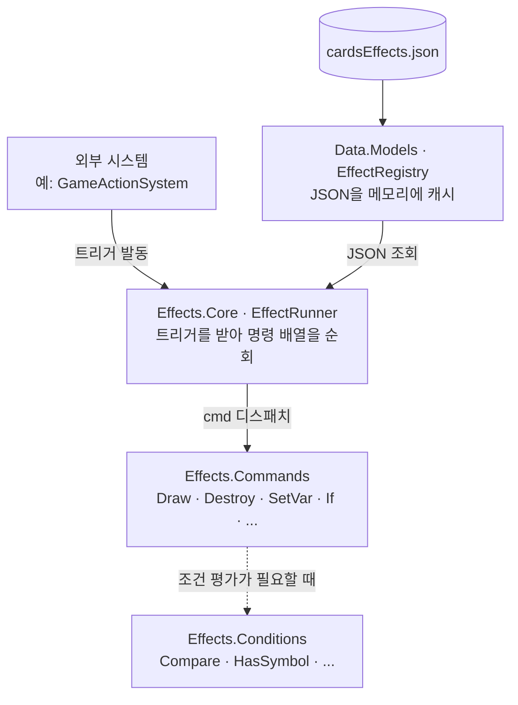

**JSON 데이터가 `EffectRegistry`에 한 번 캐시**되어 있고, **외부에서 트리거가 들어오면** `Effects.Core`의 엔진이 받아서 **`cmd` 이름에 맞는** `Effects.Commands`로 명령을 떠넘깁니다. `If`처럼 조건 평가가 필요한 명령일 때만 `Effects.Conditions`로 한 단계 더 이어집니다.

그러면 이제, 그 JSON 구조가 실제로 어떻게 생겼는지 자세히 풀어 보겠습니다.

<br>

---

<br>

#### JSON 데이터 구조

> 이 부분에서 다루는 패턴들 Command/Registry/Resolver는 처음 접하는 개념이었고, 학습 과정에서 AI의 도움을 많이 받았습니다. 다만 이 프로젝트에서 게임에 어떤 트리거와 명령이 필요한지, `amount` 자리에 어떤 형태가 들어와야 실제 카드 효과들을 표현할 수 있는지는, 기획서를 읽고 카드를 한 장 한 장 분류해가며 직접 정리했습니다.

##### 3단 구조: `cardId → trigger → commands`

[`cardsEffects.json`](./Assets/StreamingAssets/effects/cardsEffects.json)의 최상위는 단순한 맵입니다.

```json
{
  "1": {
    "OnReveal": [
      { "cmd": "SetNextDraw", "amount": 2, "skipSelection": true, "where": { "cultist": 1 } }
    ]
  },
  "3": {
    "OnReveal": [
      { "cmd": "AddTurnCycle", "amount": 1 }
    ]
  }
}
```

| 단 | 의미 |
| :--- | :--- |
| **1단** | 카드 ID. JSON 키는 문자열이라 `"1"`처럼 저장 |
| **2단** | 트리거 이름. 한 카드가 여러 트리거를 가질 수 있음 (예: `OnRevealCost`에서 비용을 받고 `OnReveal`에서 효과 실행) |
| **3단** | 명령 배열. 위에서 아래로 순차 실행 |

이 구조 하나로 "카드 N번이 *언제* *무엇을* 하는가"가 전부 표현됩니다.

위 예시 1번과 3번을 풀어 읽으면 다음과 같습니다.

**1번 카드** 풀어 읽기:

1. `OnReveal`: 이 효과가 *언제* 발동되는지. 카드가 공개되는 시점에 작동합니다.
2. `cmd`: *무엇을* 할지. `SetNextDraw`(다음 드로우 규칙을 바꾸는 명령)을 수행합니다.
3. 뒤따라오는 `amount`, `skipSelection`, `where`는 그 명령의 파라미터입니다.

→ 정리해보면 '다음 카드 가져오기 단계를 생략하고, 신도가 1인 카드 2장을 뽑는다' 라는 효과가 됩니다.

---

##### 트리거: *언제* 발화되는가

| 트리거 | 발화 시점 |
| :--- | :--- |
| `OnHand` | 손에 카드가 들어왔을 때 (드로우/교역 직후) |
| `OnReveal` | 신도 카드가 공개되어 앞면이 됐을 때 |
| `OnRevealCost` | `OnReveal` 직전. 비용(예: `Sacrifice`)을 받는 단계. 비용을 못 내면 `ctx.Cancelled = true`로 공개 자체가 취소됨 |
| `OnClick` | 앞면 카드를 클릭해 효과를 능동적으로 사용했을 때 (토페트) |
| `OnDestroyed` | 카드가 파괴/추방됐을 때 |
| `RevealCondition` | 공개 *가능 여부*를 판정하는 조건. 다른 트리거와 달리 명령이 아닌 **조건 객체 배열**이 들어감 |
| `Passive` | 상시 효과. 상태가 바뀔 때마다 재평가됨 |

`GameActionSystem`의 각 액션(`Reveal`/`Play`/`Destroy` 등)이 끝나는 지점에서 `EffectRunner`가 해당 카드의 해당 트리거 배열을 꺼내 실행합니다. 트리거가 비어 있으면(또는 카드 ID 자체가 JSON에 없으면) 아무 일도 일어나지 않습니다. 이를 통해 *효과 없는 카드*도 동일한 경로로 자연스럽게 처리됩니다.

---

##### 명령: `Command`

1. 역할
JSON 효과 스크립트의 한 줄을 실행하는 단위입니다. `"cmd": "Draw"`처럼 이름이 붙어 있고, 코드 쪽에는 `ICommand` 인터페이스를 구현한 클래스가 그 이름에 매칭됩니다. `EffectRunner`는 `cmd` 문자열을 보고 적절한 핸들러를 찾아 `ExecuteAsync`를 호출하기만 합니다.

2. JSON 형태

```json
{ "cmd": "<명령 이름>", ...명령별 파라미터 }
```

| 필드 | 의미 |
| :--- | :--- |
| `cmd` | 어떤 명령인지 식별하는 이름 (`Draw`, `Destroy`, `If`, `SetVar` 등) |
| 나머지 필드 | 명령마다 다름 (예: `Draw`는 `amount`, `Destroy`는 `from`/`amount`/`selectionType` 등) |

3. 사용 예시

```json
"OnReveal": [
  { "cmd": "Draw", "amount": 2 },
  { "cmd": "Log",  "msg": "두 장 드로우 완료" }
]
```
위에서 아래로 순서대로 실행됩니다. 코드 쪽에서는 `EffectsBootstrap`이 `Commands.Register("Draw", new DrawCommand(...))` 형태로 이름과 핸들러를 1:1로 연결합니다. 새 명령을 추가하고 싶으면 `ICommand`를 구현한 클래스를 만들고 `Register` 한 줄만 추가하면 끝입니다.

---

##### 파라미터: `amount`

1. 역할
"몇 장 / 몇 회"를 지정하는 파라미터입니다. 대부분의 카드 명령(`Draw`, `Destroy`, `Exile`, `Sacrifice` 등)이 공통으로 사용합니다. 가장 기본은 정수 하나, 그리고 "0~2장 사이" 같은 범위입니다.

2. JSON 형태

```json
"amount": <int | range>
```

| 형태 | 예시 | 의미 |
| :--- | :--- | :--- |
| 정수 리터럴 | `"amount": 2` | 정확히 2장 |
| 범위 | `"amount": { "min": 0, "max": 2 }` | Manual 선택에서 "0~2장 골라라" 용도 |

해석은 `ValueResolver.ResolveAmountRange`가 담당합니다. 정수면 (n, n), 범위면 (min, max)로 환원됩니다.

> `amount` 자리에는 정수 외에도 **변수나 게임 상태에서 계산한 값**을 넣을 수 있습니다. 이 형태(`IntExpr`)는 다음 절에서 함께 다룹니다.

3. 사용 예시
```json
{ "cmd": "Destroy",
  "amount": { "min": 0, "max": 2 },
  "selectionType": "Manual",
  "from": { "owner": "Opponent", "zone": "Field" } }
```

상대 필드 카드 중에서 최대 2장까지 골라 파괴. 0장에서 멈춰도 됩니다 (`min: 0`).

---

##### 변수와 정수 식: `SetVar` / `IntExpr`

1. 역할

다음과 같은 카드를 생각해봅시다.

> **"내가 가진 6번 카드 수만큼 뽑고, 그게 3장 이상이면 그만큼 파괴한다."**

이 효과를 JSON으로 적으려면 **같은 숫자**가 세 자리에 들어가야 합니다.

1. `Draw`의 `amount`: 몇 장 뽑을지
2. `Compare`의 `lhs`: 3과 무엇을 비교할지
3. `Destroy`의 `amount`: 몇 장 파괴할지

그런데 그 숫자는 **게임 도중에 결정**됩니다. "내가 6번 카드를 몇 장 가지고 있는가"는 카드를 만드는 *지금*은 알 수가 없으니까요.

즉, "한 번 계산해서 이름을 붙여놓고, 필요한 자리에서 꺼내 쓰자"는 발상이 `SetVar`입니다. JSON 안에서 쓸 수 있는, **그 효과의 한 번의 발동 동안에만 생성되는 지역 변수**라고 생각하면 됩니다.

2. JSON 형태

```json
{ "cmd": "SetVar", "name": "n", "value": <IntExpr> }
```

| 필드 | 의미 |
| :--- | :--- |
| `name` | 변수 이름. 위 예시에서는 `"n"`을 사용 |
| `value` | 그 변수에 저장할 값. 자세한 형태는 아래 `IntExpr`을 참조 |

3. `IntExpr`: 정수가 들어가는 자리의 공통 어휘

JSON에는 정수가 들어가는 자리가 여럿 있습니다. `amount`, 비교의 `lhs`/`rhs`, 범위의 `min`/`max`, `SetVar`의 `value` 같은 자리들이죠. 이런 자리에는 다음 **세 가지 형태** 중 무엇이든 적을 수 있습니다.

| 형태 | 예시 | 의미 |
| :--- | :--- | :--- |
| 정수 리터럴 | `3` | 숫자를 그대로 사용 |
| 변수 참조 | `{ "var": "n" }` | `SetVar`로 저장해둔 값을 꺼내 옴 |
| 인라인 계산 | `{ "type": "cardCount", "from": {...} }` | 게임 상태에서 즉석 계산 |

> 자리마다 다른 규칙을 외울 필요는 없습니다. 어느 자리든 같은 세 형태를 받고, 실제 정수로 환원하는 일은 `ValueResolver.ResolveInt`가 한 곳에서 처리합니다.

인라인 계산의 종류는 다음과 같습니다.

| 타입 | 의미 |
| :--- | :--- |
| `cardCount` | 필터를 만족하는 카드 수 |
| `playerStat` | 플레이어 스탯 (`cultist`, `strength` 등) |
| `historyCount` | 이번 턴/게임의 액션 횟수 |

4. 사용 예시

```json
"OnReveal": [
  { "cmd": "SetVar", "name": "n",
    "value": { "type": "cardCount",
               "from": { "owner":"Self", "zone":"Field",
                         "filter": { "cardIds": [6] } } } },
  { "cmd": "Draw", "amount": { "var": "n" } },
  { "cmd": "If",
    "condition": { "type":"Compare", "lhs":{"var":"n"}, "op":">=", "rhs":3 },
    "then": [ { "cmd": "Destroy", "amount": { "var": "n" }, "from": { ... } } ] }
]
```

   1. 내 필드의 6번 카드 수를 세어 `n`에 저장
   2. `n`장 드로우
   3. `n`이 3 이상이면 `n`장 파괴

---

##### 조건과 분기: `If`

1. 역할
조건을 평가해서 `then` / `else` 가지 중 하나의 명령 리스트를 실행하는 분기 명령입니다. if 분기 안에 또 다른 `If`를 넣어 중첩도 가능하며, `SetVar`로 미리 계산해둔 값을 조건의 기준으로 활용하는 패턴을 가장 자주 사용하고 있습니다.

2. JSON 형태
```json
{
  "cmd": "If",
  "condition": { "type": "<조건 이름>", ...조건별 파라미터 },
  "then": [ ...명령 리스트 ],
  "else": [ ...명령 리스트 ]
}
```

| 필드 | 의미 |
| :--- | :--- |
| `condition` | 평가할 조건. `type`으로 어떤 조건인지 식별하며, 코드 쪽에는 `ICondition` 구현체가 매칭됨 |
| `then` | 조건이 참일 때 실행할 명령 리스트 |
| `else` | 거짓일 때 실행할 명령 리스트 (생략 가능) |

현재 등록된 조건 종류:

1. `Compare` (두 수치 비교)
2. `HasSymbol`
3. `HasCultist`
4. `HasCard`

> `Compare`의 `lhs`/`rhs`에는 앞 절에서 다룬 **IntExpr**의 어떤 형태든 들어갈 수 있습니다. 변수 참조(`{ "var": "n" }`)가 가장 흔하지만, 인라인 계산(`{ "type": "historyCount", "action": "Trade" }` 등)도 됩니다.

분기 내부의 명령들은 `EffectRunner.RunNodesAsync`로 재귀 실행되므로, `If` 안에 `If`, `If` 안에 `SetVar` 같은 중첩이 자연스럽게 동작합니다!

3. 사용 예시
```json
{ "cmd": "If",
  "condition": { "type": "Compare",
                 "lhs": { "var": "n" }, "op": ">=", "rhs": 3 },
  "then": [ { "cmd": "Destroy", "amount": { "var": "n" }, "from": { ... } } ],
  "else": [ { "cmd": "Log", "msg": "조건 미달, 효과 없음" } ] }
```

1. 변수 `n`을 가져와서 3과 비교
2. `n ≥ 3`이면 `n`장 파괴
3. 아니면 로그만 남기고 종료

<br>

---

<br>

##### OCP 성립, 추가 확장

이 구조에 새 명령, 예를 들어 `Heal`(잃은 신도를 회복)을 추가한다고 가정하면 필요한 작업은 다음과 같습니다.

1. `Effects/Commands/Resource/HealCommand.cs`를 만들어 `ICommand`를 구현.
2. `EffectsBootstrap.cs`에 `Commands.Register("Heal", new HealCommand(...))` 한 줄 추가.

`EffectRunner`, `TargetResolver`, `ValueResolver`, 기존 명령들 **어디에도 손대지 않습니다.** JSON에서 `{ "cmd": "Heal", "amount": 2 }`만 쓰면 그 순간부터 모든 카드가 이 명령을 쓸 수 있습니다.

처음 설계할 때 OCP를 의식하고 짠 건 아닙니다. 기획자가 카드를 늘릴 때마다 기존 코드가 흔들리지 않도록 만들고 싶다는 목표에서 출발해, Command + Registry 패턴을 따라가다 보니 결과적으로 그 모양이 됐습니다. SOLID를 공부하면서 "아, 이게 OCP라는 거였구나" 하고 뒤늦게 이름을 붙일 수 있었던 부분입니다.

<br>

---

<br>

#### [`EffectRegistry.cs`](./Scripts/Data/Models/EffectRegistry.cs)
> JSON 카드 효과를 메모리에 적재·캐시

앞 절에서 본 `cardsEffects.json`은 디스크 위의 텍스트 파일입니다. 게임이 매번 카드 효과를 실행할 때마다 파일을 다시 읽을 수는 없으니, **앱이 시작될 때 한 번 읽어서 메모리 위의 딕셔너리 형태로 들고 있어야** 합니다. 그 역할이 `EffectRegistry`입니다.

내부는 단순합니다.

```csharp
// <CardId, trigger<트리거 이름, 명령 배열>>
// CardId → 트리거 이름 → 명령 배열(JArray)
// _effects[cardId][triggerName] = 명령 배열(JArray)
private Dictionary<int, Dictionary<string, JArray>> _effects;
```

JSON의 3단 구조(`cardId → trigger → commands`)를 그대로 중첩 딕셔너리로 풀어놓은 것입니다. 어떤 카드의 어떤 트리거에 해당하는 명령 배열을 꺼내려면 `GetTrigger(cardId, trigger)` 한 번이면 됩니다.

초기화는 앱 시작 시 `GameBootstrapper`가 단 한 번 호출합니다.

```csharp
public static async Task InitializeAsync()
{
    if (Instance != null) return;
    var registry = new EffectRegistry();
    await registry.LoadAsync();
    Instance = registry;
}
```

`Instance != null` 체크로 *멱등성*(같은 호출을 여러 번 해도 결과가 같음)을 보장합니다. 실패 시 `Instance`가 `null`로 남으므로 다음 호출이 자연스러운 재시도가 됩니다.

사실 멱등성을 넣은 *진짜 이유*는 **개발 편의**에 있었습니다. 인게임 씬에서 `EffectRegistry`가 정상적으로 적재되는지, 저장된 효과 데이터가 화면에 잘 뜨는지 확인하려면 InGame 씬을 **단독으로** 실행해 디버깅해 봐야 했습니다. 그런데 그 경우 `GameBootstrapper`를 거치지 않으므로 *공식 초기화 트리거가 없는 상태*가 됩니다. 이를 해결하려고, 어느 호출 시점에서든 안전하게 초기화가 시작되도록 멱등성 가드를 걸어둔 것이 출발점이었습니다. (아니면 계속해서 인트로 시작(사슴 우는 소리 재생), 메인메뉴에서 멀티플레이, 들어가려면 게임 클라이언트 2개 띄우거나 가상머신으로 부계 접속해서 접속... 이 과정을 계속해서 반복해야 했습니다. 물론, 후반에는 `ParrelSync`를 사용해서 그나마 쉽게 진행했지만 단순히 '현재 이펙트 시스템 등록이 잘 되는가?' 테스트를 위해서는 좀 더 쉬운 방법이 필요했습니다.)

> **즉, 1차 목적은 "씬 단독 실행을 위한 보호"였습니다.** 단순히 두 번·세 번 부르지 못하게 막아버리는 게 훠어어얼씬 깔끔하지만, 디버깅용 단독 실행이라는 요구가 있는 한 막을 수가 없었습니다.

이렇게 깔아둔 가드가 *부수적으로* 가져온 효과들도 있었습니다.

1. **호출자 부담 없음**: 코드 어디서든 `await EffectRegistry.InitializeAsync()`를 안심하고 부를 수 있게 되었습니다. "이미 초기화됐나?"를 호출자가 일일이 신경 쓰지 않아도 됩니다.
2. **방어 비용이 0에 가까움**: `if (Instance != null) return;` 한 줄. 안 깔 이유가 없는 수준의 비용입니다.
3. **결정론과 멱등성을 분리해 보게 됨**: 이걸 정리하는 과정에서 두 개념의 차이를 다시 짚게 되었습니다. 서버 기반 게임에서 흔히 강조되는 *결정론*(같은 입력 → 같은 출력, 무작위성 없음)은 `IRandomSource` 추상화의 목표이고, `EffectRegistry`가 보장하는 건 *결정론이 아닌 멱등성*이라는 점이 명확해졌습니다.
4. **싱글톤과 멱등성을 분리해 보게 됨**: 앞과 비슷하게, 싱글톤과도 비교해서 생각해보게 되었습니다. 싱글톤은 *디자인 패턴*으로 클래스의 인스턴스가 단 하나뿐이라는 것이고, 멱등성은 *함수의 속성*으로 이 함수를 여러 번 호출해도 한 번 호출한 것과 같다는 의미입니다. 헷갈릴 게 크게 없는 요소지만, '하나만 존재?'라는 단순한 접근에서 시작해서 차이점을 확실하게 구분해보았습니다.

| 개념 | 정의 | 예시 |
| :--- | :--- | :--- |
| 결정론(determinism) | 같은 입력 → 같은 출력. 무작위성 없음 | `IRandomSource` 추상화의 목표 |
| 멱등성(idempotency) | 여러 번 호출해도 첫 호출과 같은 결과/상태로 끝남 | `InitializeAsync`를 두 번 불러도 한 번 부른 것과 같음 |

---

| 구분 | 싱글톤 (Singleton) | 멱등성 (Idempotency) |
| :--- | :--- | :--- |
| 무엇 | 디자인 패턴 | 함수의 속성 |
| 보장하는 것 | "이 클래스의 인스턴스가 단 하나뿐이다" | "이 함수를 여러 번 호출해도 한 번 호출한 것과 같다" |
| 층 | 클래스 구조 (공간) | 함수 호출 (시간) |

추가로 한 가지 짚어둘 점이 있습니다. *"그럼 `EffectRegistry`는 서버 책임이 아닌가? 서버에서 한 번만 관리하면 되는 거 아닌가?"* 라는 의문이 자연스럽게 들 수 있는데, 클라이언트도 효과 *데이터*를 읽어야 하는 경우가 따로 있어서 양쪽 모두 초기화됩니다.

서버는 다음 세 가지를 책임집니다.

1. 효과 *실행* (`EffectRunner`가 카드 효과를 발동)
2. 게임 상태 *변경* (Destroy, Draw 등 실제로 일어나는 일)
3. 검증 (호스트 권위 모델)

클라이언트는 다음 상황에서 `EffectRegistry` 데이터를 *읽습니다*.

| 클라이언트가 효과 데이터를 보는 자리 | 이유 |
| :--- | :--- |
| `InGameCardUI`: 공개 시 비용 표시 | 카드를 공개하려고 클릭하기 전에 `OnRevealCost` 트리거 존재 여부를 보고, *서버에 보내기 전에* 비용 카드 UI(황금색 블룸)를 활성화 |
| `EffectValidator` | 효과 JSON 유효성 검증 시 `ClientGameStateProvider`를 통해 검증 흐름에 사용 |
| `KeywordExpander` (앱 시작 1회) | `[희생: N]` 같은 텍스트 약속어를 `EffectRegistry`에 자동 주입 |

그래서 `GameBootstrapper`는 호스트만 부르는 게 아니라 *앱 시작 시 모든 PC*(호스트든 일반 클라든)에서 `EffectRegistry.InitializeAsync()`를 호출합니다.

정리하면:

1. 효과를 *실행*하는 건 서버만
2. 효과 *데이터*는 양쪽 다 가지고 있어야 함 (UI, 미리보기 등)
3. 그래서 `EffectRegistry`는 양쪽에서 초기화되고, **멱등성 가드는 이 다중 호출의 안전망 역할**까지 함께 떠맡습니다 (앞서 짚은 *씬 단독 실행 보호*의 자연스러운 확장)

이렇게 한 번 적재된 뒤에는 게임 내내 같은 `EffectRegistry.Instance`를 공유합니다. 이후 등장할 `EffectRunner`가 트리거를 실행할 때마다 이 딕셔너리에서 명령 배열을 꺼내는 식으로 동작합니다.

`AddTrigger`는 마지막 `KeywordExpander`에서 자세히 설명하겠습니다!

#### [`TriggerContext.cs`](./Scripts/Effects/Core/TriggerContext.cs)
> 트리거 1회 실행 동안 유지되는 컨텍스트

한 번의 트리거가 실행되는 동안, 그 안의 모든 명령들이 공유하는 컨텍스트입니다. 하나의 트리거가 시작될 때 하나 만들어져서, 그 트리거 안에서 실행되는 모든 명령에 인자로 전달됩니다.

이 개쩌는 컨텍스트 안에 들어 있는 것들:

| 필드 | 의미 |
| :--- | :--- |
| `Source` | 효과를 발동시킨 카드 자신 |
| `Actor` | 효과를 발동시킨 플레이어 |
| `Cause` | (선택) 이 효과를 일으킨 다른 카드. 예: "내가 누군가에게 파괴당했을 때 발동"하는 효과라면, 나를 파괴한 카드가 `Cause` |
| `Vars` | `SetVar`로 저장한 변수들. `Dictionary<string, int>` 형태 |
| `Cancelled` | 취소 플래그. 누군가 `Cancel` 명령을 실행하면 `true`가 되고, 그 뒤의 명령은 실행되지 않음 |

트리거가 끝나면 이 컨텍스트는 버려집니다. 즉, 변수도 취소 플래그도 **다음 트리거에는 영향을 주지 않습니다.** 트리거 한 번이 컨텍스트 한 번입니다.

#### [`CommandRegistry.cs`](./Scripts/Effects/Core/CommandRegistry.cs)
> "cmd" 문자열 키 → `ICommand` 핸들러 매핑

JSON에는 `"cmd": "Draw"`처럼 명령이 **이름**으로만 적혀 있습니다. 그런데 실제로 동작하는 건 `DrawCommand`라는 C# 클래스의 인스턴스입니다. 이 둘을 연결해주는 딕셔너리가 `CommandRegistry`입니다.

내부는 단순한 `Dictionary<string, ICommand>`입니다. 게임이 시작될 때 `EffectsBootstrap`이 `Register("Draw", new DrawCommand(...))` 형태로 한 번씩 등록해두면, 이후 `EffectRunner`는 `Get("Draw")`로 인스턴스를 꺼내 쓰면 됩니다.

이렇게 딕셔너리 한 곳에 모아두면 두 가지가 좋습니다.

1. 새 명령 추가가 쉬워집니다. 새 `ICommand` 클래스를 만들고 `Register` 한 줄만 추가하면 됩니다. 기존 코드는 안 건드립니다.
2. JSON에 등록되지 않은 명령이 들어오면 경고만 남기고 무시합니다. 오타가 있어도 게임이 죽지는 않습니다. (코드는 죽지 않아요... 대가를 치를 뿐...)

#### [`ConditionRegistry.cs`](./Scripts/Effects/Core/ConditionRegistry.cs)
> "type" 문자열 → ICondition 매핑

`CommandRegistry`의 형제(와썹브로)입니다. 구조도 사용 방식도 같지만, 담는 것이 다릅니다. 명령(`ICommand`)이 아니라 *조건*(`ICondition`)을 담습니다.

`If` 명령이 등장하는 자리를 떠올려보면 이해가 쉽습니다.

```json
{ "cmd": "If",
  "condition": { "type": "Compare", "lhs": ..., "op": ">=", "rhs": 3 },
  "then": [ ... ] }
```

JSON에는 `"type": "Compare"`처럼 조건이 **이름**으로 적혀 있고, 실제로 평가하는 코드는 `CompareCondition` 클래스입니다. 이 둘을 연결하는 딕셔너리가 `ConditionRegistry`입니다.

현재 등록된 조건은 4종이며, `EffectsBootstrap`에서 한 번에 모아 등록합니다.

```csharp
Conditions.Register("Compare",    new CompareCondition());
Conditions.Register("HasSymbol",  new HasSymbolCondition());
Conditions.Register("HasCultist", new HasCultistCondition());
Conditions.Register("HasCard",    new HasCardCondition());
```

새 조건을 추가하는 비용은 명령과 동일 클래스 하나 + `Register` 한 줄. JSON에서 새 `type`을 쓰는 순간부터 `If`에서 사용할 수 있습니다.

<br>

---

<br>

#### [`ValueResolver.cs`](./Scripts/Effects/Core/ValueResolver.cs)
> JSON 동적 값(변수·카드 수 등)을 정수로 해석

앞 JSON 절의 `IntExpr` 설명에서 "정수 자리에 들어올 수 있는 세 가지 형태(정수 리터럴 / 변수 참조 / 인라인 계산)"를 다뤘는데, **그 세 가지를 실제로 정수 하나로 환원해주는 함수**가 여기에 있습니다.

`ResolveInt`는 받은 JSON 토큰의 모양을 보고 분기합니다.

| 입력 토큰 | 반환 |
| :--- | :--- |
| 정수 | 그대로 반환 |
| `{ "var": "n" }` | `TriggerContext.Vars["n"]`을 꺼내 반환 |
| `{ "type": "cardCount", "from": {...} }` | `TargetResolver`에게 카드 목록을 요청하고 그 개수를 반환 |
| `{ "type": "playerStat", "stat": "..." }` | `IEffectGameState`에서 스탯을 가져와 반환 |

이 외에 `ResolveAmountRange`라는 함수도 있어서, `{ "min": 0, "max": 2 }` 같은 범위 표현을 (min, max) 형태로 풀어줍니다.

이 변환기 하나가 있기 때문에 `DrawCommand`나 `DestroyCommand` 같은 명령들은 amount 자리에 무엇이 들어오든 **JSON 모양에 신경 쓸 필요가 없습니다.** "정수 하나 달라"고 요청하면 정수가 옵니다.

<br>

---

<br>

#### [`TargetResolver.cs`](./Scripts/Effects/Core/TargetResolver.cs)
> 카드 후보 풀 구성 + 최종 타겟 선택(Manual/Auto)

JSON에서 카드 명령은 보통 `"from"` 필드로 대상 카드를 지정합니다.

```json
"from": { "owner": "Opponent", "zone": "Field",
          "filter": { "cultist": { "op": ">=", "value": 3 } } }
```

이 내용을 보고 *"상대편 필드에서 신도가 3 이상인 카드들"*이라는 실제 CardInstance 목록을 만들어 돌려주고, 거기에 더해 *"그 중에서 몇 장을 누가 어떻게 고를지"*까지 책임지는 것이 `TargetResolver`입니다.

| 단계 | 진입 메서드 | 무엇을 |
| :--- | :--- | :--- |
| 1. 후보 풀 만들기 | `Resolve(from, ctx)` | 조건에 맞는 카드들을 전부 모아 목록으로 |
| 2. 실제로 골라내기 | `PickAsync(node, ctx)` | 그 목록에서 몇 장을 누가 어떻게 고를지 결정 |
| 3. 한 장씩 묻기 | `ManualPickOneOrDoneAsync(...)` | "최대 N장, 도중 그만 OK" (2번의 특수 형태) |

#### 진입점 1: `Resolve` (후보 풀 생성)

```csharp
public List<CardInstance> Resolve(JObject from, TriggerContext ctx, bool excludeSource = false)
```
세 단계를 차례로 적용합니다. 위 JSON 예시 ("owner": "Opponent", "zone": "Field", "filter": {...})를 따라가며 풀어보겠습니다.

1. 누구의 카드인가?
   `owner` 먼저 *"누구를 대상으로 카드를 찾을지"*를 정합니다. JSON의 `"owner": "Opponent"`를 보고 *"나 자신을 제외한, 살아있는 다른 플레이어 전부"*로 반환합니다.

   **헬퍼**: `ResolvePlayers` (`"Self"` / `"Opponent"` / `"All"` 같은 미리 정의한 약속어부터 *"신도가 가장 적은 플레이어"* 같은 통계 기반 선택까지 모두 여기서 처리)
   ```csharp
      var ownerToken = from["owner"];
      var players = ResolvePlayers(ownerToken, ctx).ToList();
   ```

   ```csharp
        public IEnumerable<Player> ResolvePlayers(JToken token, TriggerContext ctx)
        {
            var alive = _gameState.GetAlivePlayers().ToList();

            if (token == null) return new[] { ctx.Source.OwnerSeat };

            if (token.Type == JTokenType.String)
            {
                // Self: 자기 자신
                // Opponent: 나 자신을 제외한 살아있는 플레이어 전부
                // All: 나 자신을 포함한 살아있는 플레이어 전부
                return token.ToString() switch
                {
                    "Self" => new[] { ctx.Source.OwnerSeat },
                    "Opponent" => alive.Where(p => p != ctx.Source.OwnerSeat).ToList(),
                    "All" => alive,
                    _ => new[] { ctx.Source.OwnerSeat }
                };
            }

            if (token is JObject obj)
            {
                string type = obj["type"]?.ToString();
                string statKey = obj["stat"]?.ToString();

                switch (type)
                {
                    case "PlayerLowestStat": return FindLowestStat(alive, statKey);
                    case "OpponentLowerStat": return FindLowerThanSelf(alive, statKey, ctx.Source.OwnerSeat);
                    default: return Enumerable.Empty<Player>();
                }
            }

            return new[] { ctx.Source.OwnerSeat };
        }
   ```

2. 어느 영역에서 찾을 것인가?
   `zone` 대상 플레이어가 정해졌으면, 그 플레이어의 어디에 있는 카드를 볼지 결정합니다. `"zone": "Field"`이면 그 플레이어가 필드에 펼친 카드 전체를 가져옵니다. 가능한 값은 `Field` / `Hand` / `Deck` 세 가지입니다.

   **헬퍼**: `GetCardsInZone`
   ```csharp
   string zoneStr = from["zone"]?.ToString() ?? "Field";
   ```

   ```csharp
   private IEnumerable<CardInstance> GetCardsInZone(Player player, string zone) => zone switch
   {
      "Field" => _gameState.GetAllCards().Where(c => c.Zone == Zone.Field && c.OwnerSeat == player),
      "Hand" => _gameState.GetAllCards().Where(c => c.Zone == Zone.Hand && c.OwnerSeat == player),
      "Deck" => _gameState.GetAllCards().Where(c => c.Zone == Zone.Deck && c.OwnerSeat == player),
      _ => Enumerable.Empty<CardInstance>()
   };
   ```

3. 그 중 어떤 조건인가?
   `filter` 2번에서 가져온 카드 묶음에서 조건을 만족하는 카드만 남깁니다. 예시의 `"filter": { "cultist": { "op": ">=", "value": 3 } }`는 *"신도수가 3 이상인 카드만"*이라는 뜻입니다. 그 외에도 카드 ID 지정(`cardIds`), 종파 일치(`inSect`), 앞면/뒷면 상태(`isRevealed`/`isCultistCard`) 등 다양한 조건이 가능합니다.

   **헬퍼**: `ApplyFilter`
   ```csharp
   var filter = from["filter"] as JObject;
   ```

이 세 단계가 끝나면 *"상대편 필드에서 신도가 3 이상인 카드들"*이라는 실제 CardInstance 목록이 만들어집니다. 마지막에 `excludeSource == true`이면 효과를 발동시킨 카드 자신은 그 목록에서 제외합니다. 이는  "내 효과로 내가 파괴되면 안 되는" 경우에 대비한 안전장치입니다.

#### 진입점 2: `PickAsync` (실제로 카드를 골라내기)

```csharp
public async Task<List<CardInstance>> PickAsync(JObject node, TriggerContext ctx,
    bool singleOwner = false, bool excludeSource = false)
```
진입점 1번에서 조건에 맞는 카드 전부를 모았다면, 2번은 *그 중에서 실제로 몇 장을 누가 어떻게 골라낼지 결정*합니다. 내부에서는 두 가지 조건을 판별합니다.
   1. 몇 장 고를 것인가?
      `amount` 필드(`node["amount"]`)로 수량을 지정합니다. 단순 정수, 범위(min, max), 변수 참조(`{"var": "n"}`) 모두 가능합니다. 실제 정수로 환원하는 일은 앞 절의 `ValueResolver`가 담당합니다. 만약 `"amount": "All"`이라면 *후보 전체를 그대로*라는 뜻이라 별도 단축 경로로 빠집니다.
   2. 누가 고를 것인가?
      `selectionType`은 `Manual`과 `Auto` 두 가지 모드가 있습니다.

      | 모드 | 동작 |
      | :--- | :--- |
      | `Manual` | `IPlayerInputProvider`에게 후보 목록과 수량 범위를 넘기고, **플레이어의 선택이 끝날 때까지 결과를 기다림** |
      | `Auto` | `IRandomSource`로 후보를 셔플한 뒤 상위 N장을 가져옴 |

      `Manual` 호출은 다음 형태입니다.

      ```csharp
      var picked = await _input.SelectTargetsAsync(ctx.Actor, candidates, actualMin, actualMax, singleOwner);
      ```

      이 호출은 실제로는 후에 서술할 *네트워크 왕복*을 동반하지만, `TargetResolver`는 알 필요 없이 그냥 `await`로 기다립니다.

여기에서 `singleOwner == true`는 만일 2장 이상의 카드를 선택하는 경우에서 한 플레이어의 필드에서 선택하기 시작하면 다른 플레이어 필드에서는 선택하지 못하도록 강제하는 코드입니다. (기획 의도)

#### 진입점 3: `ManualPickOneOrDoneAsync`

```csharp
public async Task<List<CardInstance>> ManualPickOneOrDoneAsync(Player actor,
    List<CardInstance> candidates, bool singleOwner, bool excludeSource = false)
```

진입점 2에서만 처리하기 힘들어서 추가로 구현한 메서드입니다. *정확히 3장 파괴*와 *최대 3장까지 파괴*는 엄격하게 구분되어야 한다는 기획 의도에 맞게, 한 번에 0장 또는 1장만 묻습니다 (내부적으로 `min=0, max=1`). 호출자(예: `DestroyCommand`)는 이 메서드를 루프 안에서 반복 호출합니다. 매번 후보군을 새로 갱신해서 보여주고, 플레이어가 *"이번엔 그만"*을 누르면 빈 결과가 와서 루프가 종료됩니다.

즉, 진입점 2에서는 클릭을 한 번에 강제하는 것과 달리, 진입점 3에서는 `min`/`max`를 루프로 응용해서 플레이어의 선택을 *'~까지'* 형태로 자유롭게 만들었습니다.

---
진입점 1에서 `ResolvePlayers`, `GetCardsInZone`은 이미 코드까지 보였으니, 나머지 도우미들만 간략히 짚고 넘어가겠습니다.

`ResolvePlayers`가 부르는 통계 헬퍼 3개:

**`FindLowestStat(alive, statKey)`**: `statKey`의 스탯이 가장 낮은 플레이어를 찾습니다. 동률이면 전부 반환합니다.

```csharp
private IEnumerable<Player> FindLowestStat(List<Player> alive, string statKey)
{
    if (alive.Count == 0) return Enumerable.Empty<Player>();
    var pairs = alive.Select(p => (p, v: GetPlayerStat(p, statKey))).ToList();
    int target = pairs.Min(x => x.v);
    return pairs.Where(x => x.v == target).Select(x => x.p).ToList();
}
```

**`FindLowerThanSelf(alive, statKey, self)`**: "나를 제외하고, 나보다 `statKey`의 스탯이 낮은 플레이어들"을 모읍니다.

```csharp
private IEnumerable<Player> FindLowerThanSelf(List<Player> alive, string statKey, Player self)
{
    int selfStat = GetPlayerStat(self, statKey);
    return alive.Where(p => p != self).Where(p =>
    {
        int v = GetPlayerStat(p, statKey);
        return v < selfStat;
    }).ToList();
}
```

**`GetPlayerStat(player, statKey)`**: 위 둘이 공통으로 쓰는 한 줄짜리 스탯 조회입니다. 실제 데이터는 `IEffectGameState`에 위임합니다.

```csharp
private int GetPlayerStat(Player player, string statKey)
{
    return _gameState.GetPlayerStat(player, statKey);
}
```

**`ApplyFilter`: 진입점 1의 *"다양한 조건"* 을 풀어서**

| 필터 키 | 의미 |
| :--- | :--- |
| `isCultistCard: true` | 뒷면 카드(=신도 카드)만 |
| `isRevealed: true` | 앞면 카드만 |
| `inSect: true` | 발동 카드와 같은 종파의 카드들 |
| `inSectOfCause: true` | `ctx.Cause` 카드와 같은 종파 |
| `cardIds: [6, 7]` | 특정 카드 ID 목록 |
| `cultist: 3` | *카드의* 신도수가 정확히 3 |
| `cultist: { "op": ">=", "value": 3 }` | `op`는 `==`, `!=`, `>=`, `<=`, `>`, `<` 지원 |


여기에, 마지막으로 다음과 같은 함수가 있습니다.

`ResolveDeckCardsByFilter`는 *"덱 안에서 신도가 1인 카드를 찾아 손에 넣어라"* 처럼 owner와 zone이 이미 정해져 있고 filter만 적용하면 되는 경우의 단축 경로입니다.

```csharp
public List<CardInstance> ResolveDeckCardsByFilter(Player player, JObject filter)
```

`Resolve`가 JSON `from` 객체를 받는다면, 이쪽은 `Player`를 이미 들고 있는 코드 호출자(예: `DrawCommand`)를 위한 형태입니다. 둘 다 내부적으로는 `private` 헬퍼 `ApplyZoneAndFilter`를 부릅니다.

<br>

---

<br>

#### [`EffectRunner.cs`](./Scripts/Effects/Core/EffectRunner.cs)
> 이펙트 트리거 실행 진입점

여기까지 등장한 부품들, `EffectRegistry`(JSON 캐시), `TriggerContext`(실행 컨텍스트), `CommandRegistry` / `ConditionRegistry`(이름→핸들러 딕셔너리), `ValueResolver` / `TargetResolver`(JSON 토큰을 실제 값·카드로 환원하는 도우미)를 **하나로 묶어 실제 트리거를 실행하는 조립자**가 `EffectRunner`입니다. 카드 효과 시스템의 진입점이자, 외부 시스템(예: `GameActionSystem`)이 *유일하게 호출하는* 클래스입니다.

처리 순서는 단순합니다.

1. `EffectRegistry`에서 해당 카드와 트리거 이름에 해당하는 명령 배열을 꺼냅니다.
2. `TriggerContext`를 만듭니다 (Source/Actor/Cause/초기 변수까지 채워서).
3. 명령 배열을 위에서 아래로 한 줄씩 읽으며, 각 줄의 `"cmd"` 문자열을 보고 `CommandRegistry`에서 해당 핸들러를 찾아 실행시킵니다.
4. 모든 명령이 끝나면 `GameRuleSystem`에게 "승패/탈락 조건을 다시 확인해달라"고 알립니다.

`EffectRunner` 자신은 **개별 명령이 무엇을 하는지 모릅니다.** `Draw`가 실제로 어떤 일을 하는지, `Destroy`가 어떤 일을 하는지에 대한 지식은 각 명령 클래스의 몫이고, `EffectRunner`는 그저 `cmd` 이름을 보고 해당 핸들러에게 떠넘기는 역할만 합니다. 이 분리 덕분에 새 명령을 추가해도 `EffectRunner`는 한 줄도 안 바뀝니다!!! 앞 절의 OCP가 코드 단에서 그대로 실현되는 지점입니다. (끼얏호우)

---

---

### A. 인터페이스·인프라

#### [`IEffectGameState.cs`](./Scripts/Effects/Core/IEffectGameState.cs)
> 효과 시스템이 게임 상태와 연결된 유일한 창구

효과 코드는 게임 상태에 읽기는 가능해야 하지만 쓰기는 절대 가능해선 안 됩니다. 그래서 효과 코드가 GameState를 직접 들고 다니지 않고, 그 읽기 메서드만 추린 인터페이스 IEffectGameState를 거쳐서만 접근하게 두었습니다. 이렇게 두면 호스트 권위 모델을 유지하면서도 효과 시스템의 읽기는 확실히 보장됩니다.

```csharp
        bool IsGameEnded { get; }

        // --- 카드 관련 ---
        IEnumerable<CardInstance> GetAllCards();
        CardInstance GetCard(int instanceId);
        
        // --- 플레이어 및 스탯 관련 ---
        IEnumerable<Player> GetAlivePlayers();
        
        /// <summary>
        /// 특정 플레이어의 스탯(cultist, influence, strength 등) 값을 조회한다.
        /// </summary>
        int GetPlayerStat(Player player, string statKey);
        
        // --- 턴 및 게임 환경 관련 ---
        int GetCurrentRound();
        
        // --- 행동 이력(History) 관련 ---
        /// <summary>
        /// 특정 액션이 발생한 횟수를 조회한다.
        /// </summary>
        int GetHistoryCount(Player actor, ActionType type, string scope);
        
        // --- 필드 구조(트리) 관련 ---
        /// <summary>
        /// 특정 카드의 종파(Sect) 멤버 InstanceId 집합.
        /// 종파의 정의는 FieldTree.GetSectInstanceIds 참조.
        /// </summary>
        HashSet<int> GetSectInstanceIds(CardInstance source);
```

전부 Get으로만 구성되어 있습니다. 쓰기 메서드는 하나도 없습니다.

"그냥 프로퍼티에 `private set`을 두거나 `readonly` 키워드 쓰면 되지 않나?" 라는 생각이 들 수 있습니다. 다만 `GameState`는 게임이 진행되기 위해서 `AddPlayer`, `RegisterCard`, `RecordAction` 같은 쓰기 메서드가 반드시 있어야 합니다. 누군가는 상태를 바꿔야 게임이 흘러가니까요. 문제는 *"그 쓰기 메서드를 효과 코드한테는 숨기되, 다른 시스템 코드에게는 그대로 노출하고 싶다"*인데, 이걸 가능하게 해주는 게 인터페이스입니다.

효과 코드는 `IEffectGameState` 타입으로 `GameState`를 받습니다. 같은 객체지만 좁은 창을 통해서만 봅니다. 인터페이스에 적힌 `Get*` 메서드는 보이고, 적히지 않은 `AddPlayer` 같은 쓰기 메서드는 컴파일러가 막아줍니다. 사람의 실수를 컴파일러가 잡아주는 구조입니다.

<br>

---

<br>

#### [`IRandomSource.cs`](./Scripts/Effects/Core/IRandomSource.cs)
> RNG를 통제 가능한 형태로 가두는 장치

서버 권위의 Seed값 기반 Random을 위해 선언해두었습니다. 모든 RNG는 반드시 이 인터페이스를 거쳐서 사용됩니다.

반 강박적으로 만든 인터페이스입니다. 서버를 처음 배울 때 결정론에 대해서 배웠고, 랜덤 난수를 통제해야 한다는 것이 머릿속에 깊이 각인되어있었습니다.

처음에는 rng를 GameState에서 하나 만들고, 이를 *모든 클래스*에, 랜덤 요소가 조금이라도 들어가는 클래스에 그냥 뿌렸습니다. 그런데 이렇게 하다보니 코드가 중구난방에다가 도저히 통제를 할 수 없었습니다.

그래서, 인터페이스로 통일했습니다. 어디서 무작위가 일어나는지 추적도 용이하게, 인터페이스로 강제하면 모든 무작위가 한 길을 거치니까 로깅·시드 관리가 한 곳에 모이게 되게 구현했습니다.

하지만 지금까지의 코드를 자세히 보게 되면, 사실 이 게임 시스템에서는 호스트만 효과를 실행하므로 호스트-클라이언트 RNG 동기화는 중요하지 않습니다. 하지만 추후 게임에 리플레이도 넣고 싶고, 개발 과정에서 효과가 올바르게 작동하는지 제대로 보기 위한, 미래를 위한 장치로 남겨두었습니다.

<br>

---

<br>

#### [`ICommand.cs`](./Scripts/Effects/Commands/ICommand.cs)
> 모든 카드 효과 명령어의 공통 인터페이스

모든 cmd 효과의 공통 인터페이스입니다. 내부에는 모든 효과가 기본적으로 가져야 할 메서드와 그 파라미터가 깔★끔하게 정리되어있습니다.

<br>

---

<br>

#### [`ICondition.cs`](./Scripts/Effects/Conditions/ICondition.cs)
> 모든 조건의 공통 인터페이스

모든 조건의 공통 인터페이스입니다. ICommand와 정확히 같은 구조로, Evaluate 메서드를 모든 조건 클래스가 반드시 구현하게 합니다.

현재 등록된 조건은 `Compare`, `HasSymbol`, `HasCultist`, `HasCard` 4종이며, 각자 `ICondition`을 직접 구현합니다.

<br>

---

---

#### B. 명령들 — 단순부터 복잡

##### [`DrawCommand.cs`](./Scripts/Effects/Commands/Card/DrawCommand.cs)
> 정해진 수만큼 카드를 뽑음

Source 카드 OwnerSeat에게 즉시 N장 드로우를 요청하는 커맨드입니다.

##### [`RevealCommand.cs`](./Scripts/Effects/Commands/Card/RevealCommand.cs)
> 필드 신도 카드를 강제로 공개

효과에 의해 필드의 뒷면 카드를 강제로 뒤집는 커맨드입니다. 당연하겠지만 '뒷면' 상태인 신도카드만 뒤집을 수 있으므로 처음에

```csharp
            var from = node["from"] as JObject;
            if (from != null)
            {
                var filter = from["filter"] as JObject;
                if (filter == null) from["filter"] = filter = new JObject();
                filter["isCultistCard"] = true;
            }
```

이 작업을 통해, 카드가 뒷면인지 필터링을 거칩니다. 그 뒤에, 강제 공개를 실행합니다.

##### [`TargetedRemovalCommand.cs`](./Scripts/Effects/Commands/Card/TargetedRemovalCommand.cs)

먼저, 게임 룰 차원에서 `파괴`/`제외`/`희생`의 차이는 다음과 같습니다.

| 명령 | 의미 | 실제 액션 |
| :--- | :--- | :--- |
| Destroy | 상대 카드 파괴 | 파괴 후 교역소에 복사본 생성 |
| Exile | 상대 카드 추방 | 복사본 없이 완전 제거 |
| Sacrifice | 내 카드를 비용으로 바침 | Destroy와 같은 액션 |

세 명령은 거의 같은 일을 수행합니다. 차이는 마지막 액션 한 줄과 의미 정도만 있습니다. 그래서 공통 코드는 부모 클래스가 가져가고, 자식은 다른 부분만 채우도록 설계했습니다.

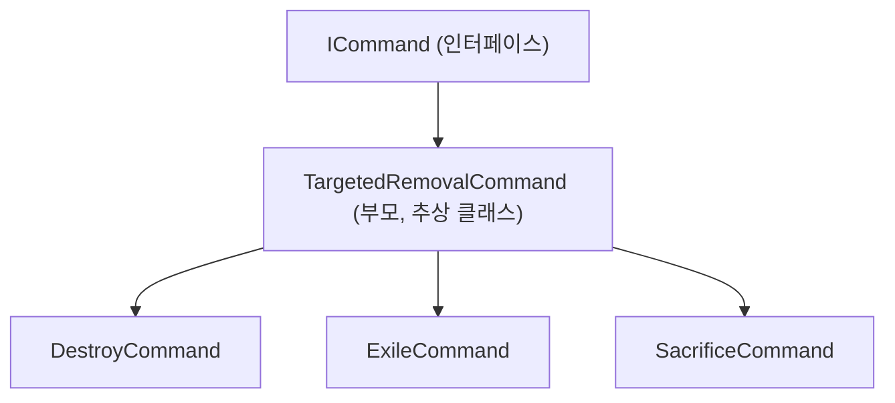

이렇게 부모가 거의 모든 일을 처리하고, 자식은 자기만의 특징을 한두 줄로 정의하고있습니다.

부모는 기본적으로 다음과 같은 일을 공통적으로 처리합니다.
- JSON에서 옵션 읽기 (amount, selectionType, singleOwner 등)
- "모두 제거" 단축 모드 처리
- 타겟팅 방식 결정 (Manual / Auto)
- 픽 루프 실행 (한 장씩 골라서 액션 적용)

이렇게 되면, 자식은 다음 3가지만 채우면 됩니다.

```csharp
// 필수 — 실제 액션 한 줄
protected abstract Task ApplyAsync(Player actor, CardInstance target);

// 선택 — 실행 전 검증/조작 (기본은 그냥 통과)
protected virtual Task<bool> PreCheckAsync(...) => Task.FromResult(true);

// 선택 — 픽 루프 끝난 뒤 처리 (기본은 아무것도 안 함)
protected virtual Task PostLoopAsync(...) => Task.CompletedTask;
```

즉, ExecuteAsync는 다음 4단계의 흐름을 거치게 됩니다.

```
[1] PreCheckAsync 호출
    → 실패하면 ctx.Cancelled = true 하고 종료

[2] amount가 "All"이면
    → 후보 카드 전부에 ApplyAsync 적용하고 끝

[3] amount가 숫자/범위면 selectionType에 따라 분기
    Manual → 단일 풀에서 사용자가 픽 (RunPickLoopAsync 1회)
    Auto   → 명단의 각 플레이어에게 자동 적용 (RunPickLoopAsync × 인원수)

[4] PostLoopAsync 호출 (Sacrifice가 여기서 뒷처리)
```

Manual과 Auto는 단순히 수동선택과 자동선택을 의미하는게 아닙니다. 사실 이 시스템에서 가장 중요한 포인트이며, `selectionType`의 타겟팅 방식 자체를 결정합니다.

|  | Manual | Auto |
| :--- | :--- | :--- |
| 후보 처리 | 전체를 하나의 풀로 합침 | 각 플레이어를 따로 처리 |
| 픽 방식 | 사용자가 직접 고름 | 랜덤 자동 |
| 자연스러운 의미 | "한 명을 골라 친다" | "모두에게 휩쓴다" |

따라서 이를 통해 같은 `owner: "All"`이라도
  - Manual이면 "누군가 한 명에게서" (사용자가 첫 픽으로 결정, 이 게임에서는 먼저 클릭한 카드의 '주인'을 저장하고, 그 플레이어 카드만 선택 가능)
  - Auto면 "모두에게 1장씩" (살아있는 모든 플레이어 각자에게 자동)

그러면 이러한 정보를 바탕으로, `RunPickLoopAsync`는 대략적으로 다음과 같이 작동하게 됩니다.

```csharp
for (int i = 0; i < max; i++)
{
    if (게임 종료) break;

    // 매 루프마다 후보를 새로 가져온다
    var candidates = _targets.Resolve(...);
    if (잠금된 owner 있음) candidates에서 그 owner만 남김;
    if (후보 없음) break;

    var picked = (Manual) ? 사용자에게 묻기 : 랜덤 1장;
    if (사용자가 Done 누름) break;

    if (singleOwner && 아직 잠금 안 됨) → 이번 픽의 owner로 잠금;

    await ApplyAsync(actor, picked);  // 자식이 정의한 한 줄
    processed++;
    await Task.Delay(200);  // 연출용 짧은 대기
}
return processed;
```

이 과정을 거쳐 `DestroyCommand`와 `ExileCommand`는 정말 한 줄만 다르게 구현했습니다.

```csharp
// DestroyCommand
protected override Task ApplyAsync(Player actor, CardInstance target)
    => _actionSystem.Destroy(actor, target);

// ExileCommand
protected override Task ApplyAsync(Player actor, CardInstance target)
    => _actionSystem.Exile(actor, target);
```

핵심은 **JSON에서 `"Destroy"` ↔ `"Exile"` 키워드만 바꿔도 타겟팅 동작은 완전하게 같게** 구현했습니다. **어디까지나 차이는 마지막에 교역소에 복사본을 남기는지, 남기지 않는지만 차이가 존재하게 구현**했습니다.

다만, `SacrificeCommand`는 조금 다릅니다. 골조는 똑같지만
1. 상대 카드가 아닌 내 카드
2. 자살방지

이 두 가지를 처리하기 위해 두 hook(*hook = virtual 키워드로 만든 "비워둔 자리"*)을 사용합니다

우선, 희생은 시작 전 검증이 필요합니다.

```csharp
protected override Task<bool> PreCheckAsync(JObject node, TriggerContext ctx)
{
    var from = node["from"] as JObject;
    if (from == null) return Task.FromResult(false);

    // owner 강제 — 희생은 항상 내 카드 대상
    from["owner"] = "Self";

    // 자살 방지
    // 내 시트, Field, 그리고 뒷면(신도카드), 그리고 방어용으로 BaseData가 비어있지 않은 것 대상
    var myCultistCards = ctx.GameState.GetAllCards().Where(c =>
        c.OwnerSeat == ctx.Actor &&
        c.Zone == Zone.Field &&
        c.CardStatus == CardStatus.FieldBack &&
        c.BaseData != null).ToList();

    int requiredAmount = ValueResolver.ResolveInt(node["amount"], ctx, _targets, 1);

    if (!CanPay(myCultistCards.Count, requiredAmount))
    {
        Debug.LogWarning($"[SacrificeCommand] {ctx.Actor} 자살 방지: " +
                            $"필드에 뒷면 신도 카드가 부족함. " +
                            $"(현재:{myCultistCards.Count}장, 요구:{requiredAmount}장 + 1장)");
        return Task.FromResult(false);
    }

    return Task.FromResult(true);
}
```

기획 의도는, '자살은 불가능'하게 만드는 것이므로, 신도가 0이 되면 게임에서 즉시 패배이므로 꼼꼼하게 처리해보았습니다.

그러면 희생이 끝난 뒤에는? 다음과 같이 처리합니다.

```csharp
protected override async Task PostLoopAsync(JObject node, TriggerContext ctx,
    EffectRunner runner, int processed)
{
    int required = amount 읽기;

    if (processed >= required)
    {
        // 비용을 다 냈으면 보상(then) 실행
        var thenBranch = node["then"] as JArray;
        if (thenBranch != null) await runner.RunNodesAsync(thenBranch, ctx);
    }
    else
    {
        // 사용자가 중간에 멈췄거나 카드 부족 → 전체 효과 취소
        ctx.Cancelled = true;
    }
}
```

핵심은 **요구한 N장을 다 희생해야 보상이 발동한다** 그리고 **도중에 멈추면 당연히 효과 자체를 취소한다.**에 중점을 두었습니다.

**static CanPay**를 좀 더 쉽게 이해하기 위해서, 지금 게임의 멀티플레이 구조가 어떻게 되는지 알 필요가 있습니다.

```
[클라이언트] "카드 18번 공개하고 싶어요"  →  [호스트]
                                            ↓
                                        판정: 가능? 불가능?
                                            ↓
[클라이언트] ← "OK/거절"             ←  [호스트]
```

이건 앞에서도 설명했듯이, 호스트가 `GameState`를 가지고 내부의 모든 정보를 처리하고, 클라이언트는 앞선 RPC B-1 메커니즘을 통해 호스트에게 '요청'을 보내야합니다.

그런데 만일, 호스트만 이 검증을 전부 처리한다고 하면 게임이 좀 답답해집니다.

1. 사용자가 자살하는 카드를 클릭
2. 클라이언트 → 호스트로 RPC 전송 (네트워크 왕복)
3. 호스트가 검증해서 "안 됩니다"
4. 클라이언트로 다시 응답 (또 네트워크 왕복)
5. UI에 "안 됩니다" 메시지 표시

이 과정을 생략하고 싶었습니다. 그러려면? 클라이언트도 미리 같은 룰을 검증해야 합니다. 자살하는 카드는 아예 하이라이트도 안 되고 클릭도 안 되게 막아두어서 자살 자체를 방지하면, 굳이 무겁게 요청을 보낼 필요도 없고, 만약에 아주 만약에 클릭해버렸네? 그럼 서버에도 요청을 보내 거절도 가능하니 일석이조입니다. (끼얏호우)

그럼 그냥 단순하게 호스트에도 짜고, 클라이언트에도 똑같은 자살 방지 로직을 짜면 되는거 아닌가? 그런데 이게 좀 위험할 수 있습니다. 둘 중 하나만 바뀌어도 이게 게임이 아주 이상해집니다. 당연하게도. 그리고 컴파일러는? 알려주지 않습니다. 매정한 녀석.

그럼 왜 또 `static`인가?

만약 일반 메서드였으면 `new SacrificeCommand(...)` 인스턴스부터 만들어야 부를 수 있습니다. 근데 클라이언트 측 코드(`InGameCardUI` 내부에서의 호출)는 `SacrificeCommand` 인스턴스를 가지고 있지 않습니다. 그쪽은 게임 시스템 의존성(`gameState`, `actionSystem` 등)을 받지 않고, UI 위에서 "클릭 가능한지" 만 판단하는 가벼운 코드기 때문입니다. `static`으로 두면 인스턴스 없이 함수 그 자체만 호출할 수 있습니다. `CanPay`는 입력(신도 카드 수, 요구량) → 출력(`true`/`false`)만 있는 순수한 산수라서 인스턴스 의존성도 필요 없습니다.

즉, 요약해보면 *호스트와 클라이언트 양쪽에서 똑같은 검증이 필요한데, 코드를 따로 짜두면 나중에 어긋날 위험이 있다. 그래서 룰을 정적 메서드 하나로 만들고 양쪽이 같은 함수를 부르게 했다. 룰을 바꿀 때 한 줄만 고치면 양쪽이 동시에 바뀐다.*

이렇게 해서 나온 결과가 바로

- 호스트(서버): PreCheckAsync에서 호출: 실제 검증
- 클라이언트: EffectValidator에서 호출: UI에서 클릭 차단

이렇게 두 곳이 같은 함수를 부르게 되므로 룰이 어긋날 일 자체를 막아두었습니다!

이를 통해 각 카드는 다음과 같이 동작하게 됩니다.

| 카드 | 명령 + 옵션 | 결과 |
| :--- | :--- | :--- |
| 7 메시아 | Destroy / Manual / Opponent / singleOwner / amount:n | 한 상대에서 n장 파괴 |
| 9 토페트 | Sacrifice / Manual / amount:1 / then(pantheon+1) | 내 신도 1장 + 만신전 1 |
| 11 정복 | Exile / Auto / 약자 1명 | 약자한테서 랜덤 1장 추방 |
| 12 전쟁 | Exile / Auto / 모두 | 자기 포함 모두 1장씩 추방 |
| 13/14 기근/죽음 | Exile / amount:"All" | 신도-N 카드 전부 추방 |
| 16~29 | Destroy / Manual / 약자 / singleOwner / 범위 | 약자한테서 0~N장 파괴 |
| 18/23/38 | Sacrifice (OnRevealCost) / Manual / amount:1 | 신도 1장 희생 → 카드 공개 → 자원 획득 |

- [`DestroyCommand.cs`](./Scripts/Effects/Commands/Card/DestroyCommand.cs)
- [`ExileCommand.cs`](./Scripts/Effects/Commands/Card/ExileCommand.cs)
- [`SacrificeCommand.cs`](./Scripts/Effects/Commands/Card/SacrificeCommand.cs)


##### [`TradeCommand.cs`](./Scripts/Effects/Commands/Card/TradeCommand.cs)
> 교역소 메커니즘으로 카드 가져오기

교역을 수행합니다. 만약에 교역을 수행 못하면? 기아를 그냥 덱에다 콱! 넣어버립니다.

##### [`StarveCommand.cs`](./Scripts/Effects/Commands/Card/StarveCommand.cs)
> 덱에 기아 카드를 추가

기아 카드를 덱에 넣어버립니다. 콱!

##### [`GetCommand.cs`](./Scripts/Effects/Commands/Resource/GetCommand.cs)
> 심볼 영구 획득

카드가 앞면으로 존재하면 즉, 카드가 '공개'되었다면 그 카드는 파괴되지 않습니다(기획의도). 따라서 카드 효과 중, `단결력을 1 얻습니다 `와 같이 Symbol G가 아닌 effect로 심볼을 획득하는 경우는 '영구 획득'으로 간주, 스탯에 영구적으로 반영시킵니다.


##### [`SetNextDrawCommand.cs`](./Scripts/Effects/Commands/Phase/SetNextDrawCommand.cs)
> 다음 드로우 단계의 규칙(`DrawRule`)을 설정

플레이어의 다음 DrawRule을 설정합니다.

##### [`AddTurnCycleCommand.cs`](./Scripts/Effects/Commands/Turn/AddTurnCycleCommand.cs)
> BonusCycle 추가

플레이어에게 `amount`만큼 `BonusTurnCycles`을 추가합니다.

추후 이를 응용해서 bonusTurnCycle을 -1 같은 식으로 보내서 플레이어의 드로우 페이즈를 넘겨버리는 강력한 카드 효과도 생각중에 있습니다.

---

#### C. 흐름 제어 — 다른 명령을 조작하는 메타 명령

##### [`LogCommand.cs`](./Scripts/Effects/Commands/Flow/LogCommand.cs)
> 디버그 출력

```csharp
        public Task ExecuteAsync(JObject node, TriggerContext ctx, EffectRunner runner)
        {
            string msg = node["msg"]?.ToString() ?? "(no msg)";
            string cardName = ctx.Source?.BaseData?.Name ?? "?";
            Debug.Log($"[CardEffect:Log] {cardName}({ctx.Source?.InstanceId}) → {msg}");
            return Task.CompletedTask;
        }
```

##### [`SetVarCommand.cs`](./Scripts/Effects/Commands/Flow/SetVarCommand.cs)
> `IntExpr` 결과를 `TriggerContext.Vars`에 이름붙여 저장

`SetVar`를 저장하는 명령어입니다.

##### [`IfCommand.cs`](./Scripts/Effects/Commands/Flow/IfCommand.cs)
> Condition 평가 → `then` / `else` 가지 중 하나를 재귀 실행

조건문 분기를 처리합니다. 

---

---

#### D. 조건들

##### [`CompareCondition.cs`](./Scripts/Effects/Conditions/CompareCondition.cs)
> 두 `IntExpr`를 op(`>=`, `==` 등)로 비교

두 수치를 비교하는 범용 조건문입니다.
```json
JSON: { "type": "Compare", "lhs": IntExpr, "op": ">"|">="|"<"|"<="|"==", "rhs": IntExpr }
```
앞서 `SetVarCommand`를 통해 저장된 `SetVar`들과, `GameState`로부터 조회한 값들을 비교하는데 사용합니다.

---

---

#### E. 조립·메타

##### [`EffectsBootstrap.cs`](./Scripts/Effects/Core/EffectsBootstrap.cs)
> 위 모든 Command·Condition을 등록·조립하는 단일 지점

각 명령어와 조건을 등록합니다. 별도의 클래스에서 개별적으로 등록하는게 아닌, 이 `EffectsBootstrap`에서 게임에 진입하면 내부에 선언된 `Register`를 자동으로 불러와 하나씩 등록합니다.

이 프로젝트에서는 `NetworkGameController`에서 게임이 네트워크에 연결되고 InGame 씬에 진입했을 때 호출하여 로그로 띄워줍니다!


<br>

---

<br>

#### Chapter 5. 승패 판정 시스템
> 필드 상태 기반 스탯 재계산 그리고 승리 조건

##### [`StatSystem.cs`](./Scripts/Systems/StatSystem.cs)
> 필드 카드들로부터 교주·상징 스탯을 재계산

이벤트 기반으로, 스탯이 변경되는 모든 시점에 `AfterChange`를 호출하여 이벤트를 전파하는 간단한 구조입니다.

```csharp
private void AfterChange(Player player, PlayerState p, string reason)
{
    Debug.Log(
        $"[StatSystem] {player} {reason} → Cultist: {p.Cultist}, " +
        $"Strength: {p.Symbols[(int)Symbols.Strength]}, " +
        $"Unity: {p.Symbols[(int)Symbols.Unity]}");

    _gameRuleSystem?.CheckStatConditions();
}
```

##### [`GameRuleSystem.cs`](./Scripts/Systems/GameRuleSystem.cs)
> 승/패 조건 판정·플레이어 탈락·게임 종료 결정

게임의 규칙에 따라 승리 및 패배를 분석합니다. 게임의 특수 승리인 만신전, 모든 덱이 끝났을 경우 나오는 사기사를 이용한 승패 구분 로직 그리고 신도수 제거로 마지막 남은1인이 된 사람이 승리하는 로직까지 구현해두었습니다.

사기사 승리의 경우 [만신전이 더 많은 사람 → 신도수가 더 많은사람 → 후턴] 순서로 승리자가 결정됩니다.

<br>

---

<br>

#### RPC 작동 원리와 메커니즘 B 복습

[RPC(Remote Procedure Call,원격 프로시저 호출)란, 별도의 원격 제어를 위한 코딩 없이 *다른 주소 공간에서 **함수나 프로시저**를 실행할 수 있게 하는 프로세스 간 통신 기술*을 말합니다. 즉, RPC를 이용하면 프로그래머는 함수 또는 프로시저가 실행 프로그램이 존재하는 로컬 위치에 있든, 원격 위치에 있든 상관없이 동일한 기능을 수행할 수 있습니다.](https://co-no.tistory.com/entry/%ED%86%B5%EC%8B%A0-RPCRemote-Procedure-Call%EC%9D%98-%EA%B0%9C%EB%85%90-%EB%B0%8F-%ED%8A%B9%EC%A7%95)

쉽게 말해, 멀리 있는(`Remote`) 서버의 함수(`Procedure`)를, 마치 내 컴퓨터에 있는 함수처럼 호출(`Call`)하는 기술입니다. 핵심은 개발자가 네트워크 통신의 복잡한 과정(소켓 연결, HTTP 통신, 데이터 파싱 등)을 몰라도, 익숙한 '함수 호출' 방식으로 다른 컴퓨터와 통신할 수 있게 해주는 것입니다.

멀티플레이에서는 호스트의 RAM과 클라이언트의 RAM과 다른 플레이어의 RAM이 물리적으로 다른 위치에 있습니다. 즉, *변수 하나를 공유할 수 없습니다.*

이게 네트워크의 핵심 문제입니다. 내가 마우스로 카드를 클릭해도, 그 클릭 이벤트는 내 컴퓨터에만 존재합니다. 네트워크에서는 **컴퓨터끼리 정보를 주고받을 방법이 있어야 게임이 성립**합니다.

요약해보면, 하나의 게임 씬을 공유하며 네트워크 게임을 플레이 위해서는 동일한 함수를 사용해야 하지만 동일한 RAM을 사용하여 물리적으로 떨어진 컴퓨터간의 공유는 할 수 없기에, RPC를 사용하는 것입니다.

가령, RPC를 사용하지 않는 상황에서 다음과 같은 상황이 았다고 생각해봅시다.

```
P2 컴퓨터 (클라이언트):
   사용자가 "메시아" 카드 클릭
   InGameCardUI.OnLeftClick 실행됨
   ... 그래서 뭐?
```

P2는 그냥 자기 컴퓨터의 변수를 바꾼 사람이됩니다(슬픔). 호스트의 게임 상태는 P2의 컴퓨터에 없기에 그냥 P2 혼자 '내 카드를 뒤집겠다'라고 시도해봤자 호스트도 모르고, 다른 플레이어도 알 방법이 없습니다.

이를 해결하기 위해서는 P2가 호스트에게 '나 이거 뒤집고 싶어'라고 메시지를 보내야합니다
    → `Cmd_RevealCard` (Command RPC)

호스트의 효과 코드가 P3한테 카드 선택을 시키고 싶다면 

```
호스트:
   effect 코드: var card = await _input.SelectCardToKeepAsync(P3, ...)
   ... 어떻게 P3의 화면에 UI를 띄우지?
```

호스트는 *자기 컴퓨터의* UI만 띄울 수 있습니다. P3의 모니터는 호스트가 직접 접근할 수 없는 다른 컴퓨터입니다.

이를 해결하기 위해서는호스트가 P3 클라이언트한테 "사용자한테 카드 선택 UI 보여줘" 라고 메시지를 보내야 합니다.
    → `TargetRpc_RequestSelectCardToKeep` (TargetRpc)

이번에는 호스트가 카드 한 장을 파괴하는 경우를 생각해봅시다.

```
호스트:
   GameState의 카드 상태가 FieldBack → FieldDestroyed로 변경됨
   ... 그래서 다른 사람들 화면에서는 어떻게 사라지지?
```

다른 플레이어들 화면에는 여전히 카드가 살아 있게 표시됩니다. 그들의 컴퓨터에는 호스트의 `GameState`가 없으니까요(`GameState`는 오직 호스트만!).

이를 해결하기 위해서는 호스트가 모든 클라이언트한테 "이 카드 이제 파괴됨" 이라고 알려야 합니다.
    → `SyncList` 갱신 (이것도 일종의 자동 RPC)

여기까지 보면, 익숙한 무언가가 떠오를 것입니다. 바로 앞에서 [`데이터 흐름 및 통신 방식`](#데이터-흐름-및-통신-방식)을 설명하면서 이야기했던, 게임 진행 중 통신에서 설명한 메커니즘 B가 그대로 들어가있습니다. 처음 설명했던 부분 중 해당 부분을, 지금 코드와 함께 설명하기 전 조금 더 자세히 풀어서 설명하고 있습니다!

그러니깐, 이 RPC라는 놈은 선택이 아닌 필수입니다. 컴퓨터끼리 메모리 공유가 없는 한, 정보를 주고받으려면 네트워크로 메시지를 보내야 하빈다. 그 메시지를 함수 호출처럼 보이게 감싸준 것이 RPC입니다.

만약에 RPC를 안쓴다? 그럼 소켓을 직접 짜거나(고통) HTTP 요청을 보내야 하는데 그럼 REST API처럼 매번 연결 열고 닫고, 응답 기다리고... 실시간 게임에서 쓸 방법으로는 너무너무너무 느립니다. **RPC는 이 두 방식의 귀찮은 부분을 전부 다 자동화하고 있습니다. Mirror가 함수 인자를 자동으로 직렬화하고, 네트워크로 전송하고, 반태편에서 다시 함수 호출 형태로 복원**해줍니다. 그래서 코드를 짤때는 그냥 어트리뷰트 하나 딸깍 붙여주면 끝!입니다.

그럼 이 RPC가 어디에 쓰이는지는, 각 어트리뷰트에 따라 다르겠지만 머릿속에 어느정도 그려지게 됩니다.

| 어트리뷰트 | 누가 부르면 | 누가 실행 | 우리 게임에서 쓰이는 자리 (역할) | 구체적 예시 |
| :--- | :--- | :--- | :--- | :--- |
| **[Command]** | 클라이언트가 부르면 | 호스트가 실행 | 사용자 행동을 호스트에 전달 | 카드 클릭, Draw/Trade 선택, 카드 뒤집기 |
| **[TargetRpc]** | 호스트가 부르면 | 지정한 클라이언트가 실행 | 호스트가 특정 플레이어한테 UI 띄우기 요청 | "P2야, 카드 한 장 골라줘" |
| **[ClientRpc]** | 호스트가 부르면 | 모든 클라이언트가 실행 | 전체에 같은 효과음 / 연출 적용 | 사기사 강림 효과음 |
| **[SyncVar] / SyncList** | 호스트가 값을 바꾸면 | 모든 클라이언트에 자동 반영 | 게임 상태 자동 동기화 | 카드 위치, 신도수, 좌석 번호 |

가령 P1이 카드를 한 장 뒤집을 때는 다음과 같이 작동하게 됩니다.

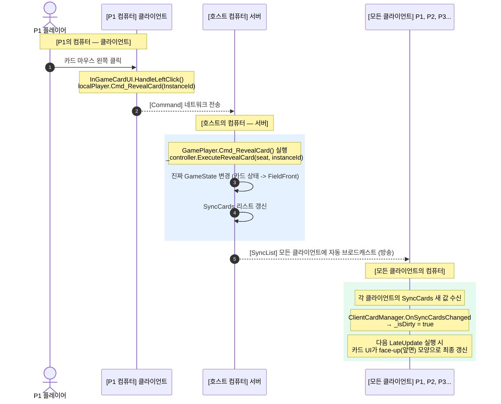
- `[Command]`: P1의 클릭을 호스트에 전달 (없으면 호스트가 클릭을 모름)
- SyncList: 자동 동기화. 호스트의 상태 변경을 모든 클라에 전달 (없으면 다른 사람 화면에서는 카드가 안 뒤집힘)

카드 효과로 P2한테 카드를 골라달라고 요청할 때는 다음과 같이 작동하게 됩니다.

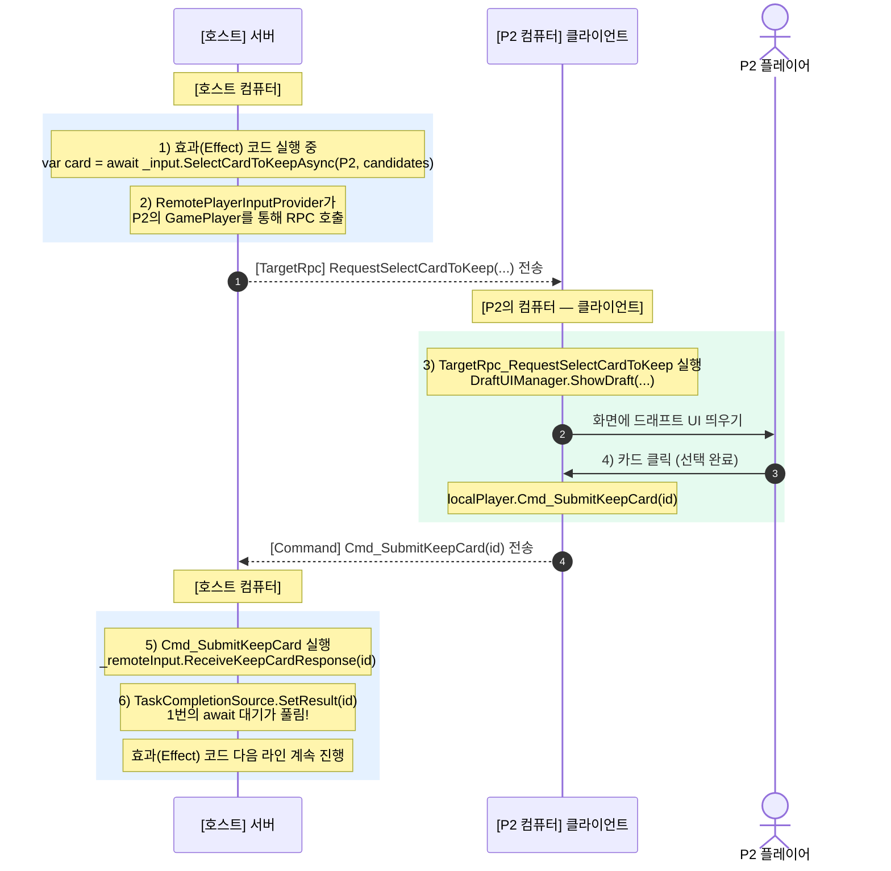
- `[TargetRpc]`: 호스트가 P2에게만 "UI 보여줘" 메시지 전송
- `[Command]`: P2의 답을 호스트로 전송

이러한 전체 흐름을 보고, 이제 이 다이어그램을 보면 전체 네트워크를 대략적으로 이해할 수 있습니다!!!!

전체 흐름
```mermaid
flowchart TD
    subgraph Host ["호스트 (방장 = 서버 + 본인 클라이언트)"]
        direction TB
        subgraph GameState ["진짜 게임 상태 (GameState)"]
            direction TB
            Data["Cards, Players, Field, Symbols, ..."]
            Effect["Effect 시스템 (await로 사용자 입력 대기 가능)"]
        end

        InputProvider["RemotePlayerInputProvider\n(TCS 관리)"] <--> Controller["NetworkGameController\n(게임 단위 라우팅 + 동기화)"]

        GameState ~~~ InputProvider

        subgraph HostPlayers [" "]
            direction LR
            HP1["GamePlayer(P1)"]
            HP2["GamePlayer(P2)"]
            HP3["GamePlayer(P3)"]
        end
        
        InputProvider ~~~ HostPlayers
    end

    Mirror{{"Mirror가 자동 동기화"}}

    HP1 --> Mirror
    HP2 --> Mirror
    HP3 --> Mirror

    subgraph Client1 ["P1 클라"]
        direction TB
        C1_GP["GamePlayer\n(각자 자기 사본)"]
        C1_CM["ClientCardMgr\n(UI 그리는 곳)"]
        C1_UI["UI"]
        C1_GP --- C1_CM --- C1_UI
    end

    subgraph Client2 ["P2 클라"]
        direction TB
        C2_GP["GamePlayer\n(각자 자기 사본)"]
        C2_CM["ClientCardMgr\n(UI 그리는 곳)"]
        C2_UI["UI"]
        C2_GP --- C2_CM --- C2_UI
    end

    subgraph Client3 ["P3 클라"]
        direction TB
        C3_GP["GamePlayer\n(각자 자기 사본)"]
        C3_CM["ClientCardMgr\n(UI 그리는 곳)"]
        C3_UI["UI"]
        C3_GP --- C3_CM --- C3_UI
    end

    Mirror --> C1_GP
    Mirror --> C2_GP
    Mirror --> C3_GP

    %% 스타일링
    classDef host fill:#000000,stroke:#000000,stroke-width:2px;
    classDef client fill:#000000,stroke:#000000,stroke-width:2px;
    classDef state fill:#000000,stroke:#000000,stroke-dasharray: 5 5;
    classDef mirror fill:#000000,stroke:#000000,stroke-width:2px;

    class Host host;
    class Client1,Client2,Client3 client;
    class GameState state;
    class Mirror mirror;
```

그럼 이제, 이러한 이해를 바탕으로 네트워크 관련 코드를 박★살 내보도록 하겠습니다.

#### Chapter 6. 비동기 플레이어 입력 처리
> `TaskCompletionSource` RPC 기반 `await` 처리

우선, Chapter 6의 전체적인 흐름을 다이어그램으로 깔끔하게 보고 시작하겠습니다.

Chapter 6 다이어그램
```mermaid
flowchart TD
    subgraph Host_Req ["호스트 (요청 단계)"]
        direction TB
        Step1["① 효과 코드\nvar card = await _input.SelectCardToKeepAsync(P2, ...)"]
        Step2["② RemotePlayerInputProvider\n- KeepCardTcs (TaskCompletionSource) 생성\n- TargetRpc_RequestSelectCardToKeep 호출\n- tcs.Task 반환 (여기서 효과 코드는 대기 상태 돌입)"]
        
        Step1 -->|인터페이스 호출| Step2
    end

    Net1{{"※ 네트워크 (TargetRpc) ※\nMirror가 P2 클라이언트로 전송"}}

    Step2 --> Net1

    subgraph Client ["P2 클라이언트"]
        direction TB
        Step3["③ GamePlayer.TargetRpc_RequestSelectCardToKeep 실행\n→ OnTargetSelectionRequested 이벤트 발화"]
        Step4["④ ClientCardManager / DraftUIManager\n→ 사용자에게 카드 선택 UI 표시"]
        Step5["⑤ 사용자 클릭\n→ InGameCardUI → ClientCardManager\n→ localPlayer.Cmd_SubmitKeepCard(선택한_id) 호출"]

        Step3 --> Step4 --> Step5
    end

    Net1 --> Step3

    Net2{{"※ 네트워크 (Command) ※\nMirror가 호스트로 전송"}}

    Step5 --> Net2

    subgraph Host_Res ["호스트 (응답 처리 단계)"]
        direction TB
        Step6["⑥ GamePlayer.Cmd_SubmitKeepCard 실행\n→ _controller.OnClientSubmitKeepCard(id) 호출"]
        Step7["⑦ NetworkGameController\n→ _remoteInput.ReceiveKeepCardResponse(id)"]
        Step8["⑧ RemotePlayerInputProvider\n→ 대기 중이던 KeepCardTcs.TrySetResult(id) 호출"]
        Step9["⑨ ①의 await가 풀림!\n← 카드 객체를 전달받아 멈춰있던 효과 코드 마저 진행"]

        Step6 --> Step7 --> Step8 --> Step9
    end

    Net2 --> Step6
    
    %% TCS await 해제 흐름을 시각적으로 강조하는 점선
    Step8 -. "TCS 결과 세팅\n(await 해제)" .-> Step1

    %% 스타일링
    classDef host fill:#000000,stroke:#000000,stroke-width:2px;
    classDef client fill:#000000,stroke:#000000,stroke-width:2px;
    classDef network fill:#000000,stroke:#000000,stroke-width:2px;

    class Host_Req,Host_Res host;
    class Client client;
    class Net1,Net2 network;
```

Chapter 6은 *플레이어 입력 처리* 입니다. 호스트가 특정 플레이어에게 카드 선택을 요청하고, 답이 올 때까지 `await`로 기다리는 흐름입니다.

효과 코드 입장에서는 `await SelectCardToKeepAsync(...)` 한 줄로 끝납니다. 그 사이에 네트워크 왕복이 일어나든 말든 효과 코드는 신경 쓸 필요가 없습니다. 이걸 가능하게 만드는 게 `TaskCompletionSource`로, *답이 올 때까지 깨우지 마* 라는 의미의 Task를 만들어 효과 코드에 넘기는 도구입니다.

---

<br>

---

##### [`RemotePlayerInputProvider.cs`](./Scripts/App/Network/RemotePlayerInputProvider.cs)
> 호스트 코드가 await 한 줄로 응답을 기다릴 수 있게, RPC 요청과 응답 사이를 Task로 묶어주는 어댑터

- 보통 `Task`는 *내가 비동기로 일하다 끝나면 알려줄게* 패턴이라 스스로 끝납니다.
- TCS는 반대로 *외부에서 완료 신호를 줄 때까지 기다리는 Task를 직접 만들 수 있게* 해줍니다.

```csharp
var tcs = new TaskCompletionSource<int>();   // 미완성 Task 만들기
// ... 어딘가에서 tcs.SetResult(42) 호출되면 ...
int result = await tcs.Task;                  // 그 순간 await가 풀리고 42 받음
```

RPC 응답처럼 *외부 이벤트를 기다려야 하는* 상황에 딱 맞는 도구입니다. 이 클래스는 입력 종류별로 TCS를 멤버 필드로 들고 있고, 각 입력마다 **요청 메서드 + 응답 메서드** 가 짝을 이룹니다.

| 요청 (효과 코드가 부름) | 응답 (Controller가 부름) |
| --- | --- |
| SelectTargetsAsync | ReceiveTargetResponse |
| SelectDrawPhaseAsync | ReceiveDrawActionResponse |
| SelectCardToKeepAsync | ReceiveKeepCardResponse |
| SelectCardFromTradeAsync | ReceiveTradeSelectResponse |

패턴은 모두 같습니다. *요청 쪽은 TCS 만들고 → RPC 보내고 → Task 반환*, *응답 쪽은 TCS에 SetResult 호출*. 그게 전부입니다.

대표로 `SelectCardToKeepAsync` 하나만 뜯어봅시다. *호스트에서 P2한테 후보 N장 중 하나 골라달라고 부탁하고, 답이 올 때까지 기다리는 Task를 반환하는* 함수입니다.

```csharp
public Task<CardInstance> SelectCardToKeepAsync(Player player, List<CardInstance> cardInstances)
{
    _keepCardTcs = new TaskCompletionSource<int>();   // ① 미완성 Task 발급

    // 객체는 무거우니까 네트워크로 보낼 int 배열로 추림
    var ids = cardInstances.Select(c => c.InstanceId).ToArray();
    var cardIds = cardInstances.Select(c => c.CardId).ToArray();

    // 해당 플레이어 클라이언트에게 UI 띄우라고 RPC 발사
    var gamePlayer = _controller.GetPlayerComponent(player);
    if (gamePlayer != null) gamePlayer.TargetRpc_RequestSelectCardToKeep(ids, cardIds);
    else _keepCardTcs.SetResult(ids.FirstOrDefault());   // 비정상 시 첫 카드 자동 선택

    // 답(int)이 오면 CardInstance로 변환해서 호출자에게 돌려줌
    return _keepCardTcs.Task.ContinueWith(t =>
        _controller.ServerGameState.Cards.GetValueOrDefault(t.Result));
}
```

읽을 때 짚어둘 포인트 세 가지만 짚고 넘어가겠습니다.

**TCS가 `<int>`인 이유.** 클라이언트는 응답으로 카드 객체 통째로가 아니라 `InstanceId`(int) 만 보냅니다. 객체엔 다른 객체 참조가 잔뜩 달려 있어 네트워크로 통째로 못 보내거든요. 앞서 굳이굳이 InstanceId 생성기를 만들어 둔 이유가 여기서 드러납니다.

**`ContinueWith`로 한 번 더 감싼 이유.** `_keepCardTcs.Task`는 *int* 를 돌려주는 Task인데, 호출자가 받고 싶은 건 *CardInstance* 객체입니다. `ContinueWith`는 *이 Task가 완성되면 그 결과를 람다에 통과시켜서 새 Task를 만들어줘* 라는 변환기입니다. 즉 `int → CardInstance` 변환 책임을 입력 제공자가 끝까지 짊어지고, 호출자는 `await` 한 줄로 깔끔하게 객체를 받습니다.

**`else`의 SetResult.** `GamePlayer`를 못 찾는 비정상 상황(네트워크 끊김 등)에는 첫 카드를 자동 선택하면서 `SetResult`를 즉시 부릅니다. Task가 그 자리에서 완성되니 효과 시퀀스가 멈추지 않고 굴러갑니다.

응답 쪽은 정말 한 줄입니다.

```csharp
public void ReceiveKeepCardResponse(int selectedInstanceId) =>
    _keepCardTcs?.TrySetResult(selectedInstanceId);
```

`TrySetResult`가 호출되는 순간 위 Task가 *완성* 상태로 바뀌고, 효과 코드의 `await`가 풀립니다.

조금 특이한 케이스가 `ReceiveTradeSelectResponse`입니다. *Draw/Trade 선택 단계* 에서 사용자가 교역소 카드를 곧바로 클릭하면 두 가지(① Trade를 하기로 함, ② 이 카드로 Trade함)가 동시에 결정됩니다. 이때 `_pendingTradeCardId`에 카드 ID를 잠시 보관해 두고, 다음 `SelectCardFromTradeAsync`가 호출되는 순간 그 값을 결과로 흘려줍니다. 한 클릭으로 두 단계가 이어지는 UX를 위한 처리입니다.

##### [`IPlayerInputProvider.cs`](./Scripts/Effects/Interfaces/IPlayerInputProvider.cs)
> 효과 시스템의 플레이어 입력 요청 용 인터페이스. 네트워크가 어떻게 돌든 효과 쪽은 모르게 가려둠

효과 시스템이 *플레이어한테 카드 하나 골라 달라* 같은 입력을 요청할 때 부르는 인터페이스입니다. 4개 메서드만 정의하고 실제 구현은 다른 파일에 맡깁니다.

| 메서드 | 의미 |
| --- | --- |
| SelectTargetsAsync | 카드 효과의 타겟을 N장 골라 달라 |
| SelectDrawPhaseAsync | Draw / Trade 중 어느 행동을 할지 |
| SelectCardToKeepAsync | 드래프트에서 한 장 골라 달라 |
| SelectCardFromTradeAsync | 교역소에서 한 장 골라 달라 |

전부 `Task<...>`를 반환해서, 효과 코드는 `var result = await _input.SelectCardToKeepAsync(...)` 한 줄로 답을 기다릴 수 있습니다.

인터페이스로 분리한 이유는 효과 시스템이 *누가 어떻게 사용자한테 물어보는지* 알 필요가 없어서입니다. 멀티플레이면 RPC 왕복, 자동 테스트면 미리 정해둔 값을 돌려주는 식으로 구현을 갈아끼울 수 있게 구현했습니다.


<br>

---

<br>
